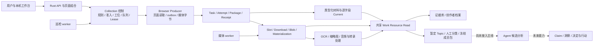

# Linggan Intelligence 全项目梳理报告

> 状态: 一次性报告
> 最后核对: 2026-09-05
> 适用范围: `AUD-INTELLIGENCE-20260905`；产品、领域、Rust/API/worker、PostgreSQL、Browser Producer、媒体、UI/UX、Topic/Agent、运行与协作
> 事实来源: Mog 在当前对话认可的全项目审计方案及补充“向外看”的要求；固定主线 `4864edd466d379dc7c9d0e7000e4e5cb3ec3d111`；本机只读查询、浏览器检查与本轮自动/隔离 PostgreSQL 验证；Issue #130 正文及 v1.2 设计评论
> 冲突时以谁为准: 更新的真实代码、运行结果与用户决定；本报告是时点审计，不替代产品合同，不授予修复、采集、部署或合并权限

配套材料：[证据、验证与复核附录](intelligence-system-review-2026-09-05-evidence.md)。正文中的 E01–E16 对应附录证据编号。时间未另行标记时为北京时间；数据库原始时间在附录保留 UTC。补充说明：§3 与 §7 已根据 Mog 提醒及 Issue #130 修订；此前把跨行业观察列为遥远后续项、把 Topic 当作所有分析的必经阶段的表述不再采用。其余运行数据仍是原审计时点，未因讨论而重跑或刷新。

## 1. 整体判断

**Intelligence 已形成可运行、可追溯的本机采集与材料研究底座，当前产品价值主要集中在采集运营和证据库。持续研究、候选分析与判断复用的用户流程仍未形成实际使用闭环。**

这个结论有两部分需要同时保留。

已经具备的部分有真实依据：Rust 服务与两个 worker 在运行；数据库 migration 与本次主线一致；来源材料能经过 Package、Receipt、作品投影和本地媒体接口到达页面；复观测、作者/目标分责、逐字段 Current、任务资格和媒体处置已有实现及负向测试。本轮 197 项常规 Rust 测试、118 项隔离 PostgreSQL 测试和 252 项插件测试通过。60 个本地 Blob 的实际文件、大小和哈希全部匹配。[E01–E07]

尚未达到的部分也很具体：46 个作品身份中，只有 3 个作品有详情和评论材料；Topic 六张业务表全部为空；Agent 候选分析只在 Draft PR #116 中，未进入主线；雷达与洞察导航明确禁用。当前四个观察目标均未开启巡检，插件心跳和账号资格观察已经过期。因此无法宣称系统正在持续取得新材料，更无法宣称它已持续产出有用的领域情报。[E03、E05、E09、E10]

**主要推进建议：为当前采集交付设置有限的结束条件，同时把首轮研究所需的材料与判断结果定义清楚；以一个有用的研究结果检验底座，而不以全部材料齐备作为进入智能化的门槛。** 产品同时覆盖本领域研究与跨行业表达观察。后者已有 #130 的明确设计，不能被降为可有可无的扩展；其首版仍以采样、浏览和随手记为边界。具体施工顺序由 Mog 决定，详见 §7。

## 2. 审计边界和版本基线

本轮以固定版本开展调查，未修改业务代码、共享数据库、观察规则、插件安装或常驻服务。数据库使用只读事务；测试写入单独的临时 PostgreSQL 容器、数据库与数据卷。浏览器只访问本机页面并查看状态，没有提交采集、恢复、认领或模型调用动作。

| 对象 | 本轮确认的状态 | 解释边界 |
|---|---|---|
| 远端主线 | `4864edd`；PR #161 合并提交 | 开始及报告编写前通过 `git ls-remote` 核对 |
| 共享开发目录 | `main@8df0b2d`，落后该主线 30 个提交；存在文档修改和历史 ZIP 删除 | 保留原状，没有同步、暂存或覆盖这些改动 |
| 本轮审计目录 | `.worktrees/intelligence-system-audit-20260905`，从固定主线建立 | 报告与索引改动单独保存在此处 |
| 正式本机服务 | API PID 21964、巡检 PID 21967、媒体 PID 21971；cwd/txt 均来自 `runtime-main` | 运行目录 HEAD 为 `4864edd`；服务没有在 health 中提供独立嵌入式 build SHA |
| 预览服务 | PID 14634，来自 `.worktrees/main-preview@d5b7886` | 与正式 `:3000` 服务分开；未更改或终止 |
| 数据库 | PostgreSQL 16.14；80 张 public 表；35 份 migration 全部匹配 | 编号到 0036，编号间存在空位；35 份是实际文件数量 |
| 插件发行物 | 0.8.37，发布包哈希与可复现构建相符 | 服务端最近已认领安装也上报 0.8.37，但不代表浏览器此刻在线 |

版本状态来自 E01–E04。未部署任何审计产物，未重新执行真实平台 Canary。报告不承担全文件逐行安全审查、正式性能压测、灾备恢复演练或法律合规认定。

## 3. 产品、领域和实际系统结构

### 3.1 产品的长期目标与当前落点

已确认的长期目标包含两条观察线：一条持续研究 ADHD 领域，保存可追溯材料与版本化观察，组织研究语言，支持可以被挑战和修订的判断；另一条观察外部领域的标题、封面、内容结构和文案逻辑，帮助 Mog 发现值得学习的表达方式。当前一级研究 Domain 为 ADHD，#130 的外部采样领域配置不自动扩展正式知识 Domain。Corpus 负责材料选择、阅读、检索和复用，Evidence 保存取得材料的依据，二者职责不同。[E08、E16]

当前实际产品的主要落点如下。

| 用户任务 | 现有表面与实现 | 目前的实际边界 |
|---|---|---|
| 管理观察对象与执行条件 | Collection 的待处理、观察目标、生产流、采集任务、执行工位五个页面 | 能读到真实规则、工位、任务、回执和档案状态；本次观察为暂停/未启用状态 |
| 阅读已取得的材料 | Evidence Library、筛选、三种布局、Inspector、来源轨迹与本地媒体 | 46 个作品可读；深度详情/评论集中在 3 个作品；评论研究和已存查询的独立入口尚未接通 |
| 向外观察内容表达 | #130 已确认跨行业观察设计，初始外部领域为考研自习、自闭症干预 | Issue 仍 open；主线未发现该模块实现；第一版是采样、同形卡片浏览、散点挑选、随手记及搜索/筛选/导出 |
| 对一个问题组织研究材料 | Topic 定义版本、人工 Classification Run、Material Pack、导入回执与只读工作区 | 数据和接口已实现，真实库为空；入口固定跳转到一个 canonical key，页面没有创建研究的操作流程 |
| 获得候选分析 | Draft #116 中的 A1–A2 合同、持久运行结构和适配器接口 | 主线没有这些模块；未证明真实模型执行和用户使用 |
| 发现变化并形成正式洞察 | 领域不变量、架构和页面规格 | 雷达/洞察运行入口未接通；正式 Claim、分析发布物和行动结果闭环未在主线形成 |

### 3.2 两条观察线与智能化的位置

| 观察方向 | 希望逐步支持的判断 | 材料边界 | 当前约定 |
|---|---|---|---|
| 向内：本领域研究 | 具体场景里人们如何表达困难、内容供给怎样组织、哪些解释值得继续验证 | 判断必须由相应本领域材料支持；样本不自动代表总体需求 | 复用已有材料和暂定 Topic 能力，先完成一次真实研究 |
| 向外：跨行业表达观察 | 别人如何吸引注意、组织理解、展开叙述；哪些手法值得记录，何时可能失效 | 外部样本是表达参照，不能成为 ADHD 事实或市场判断的证据 | #130 首版不做自动归纳、跨领域问题对齐、Topic、市场洞察或行动接入 |

#130 将两条线放在同一语料 UI 下，但保持数据和接口隔离；数据库约束承担跨行业样本归属隔离，不依赖页面筛选。它不是把所有资料混入 Evidence 后再要求模型自行辨认。[E16]

研究也有两种入口：已有问题时，先复用材料回答问题；尚无明确问题时，在有限范围内观察样本，记录意外现象，让新问题浮现。只保留第一种会使“向外看”退化为验证已经想到的东西。长期上，两者均可产生后续研究需要；#130 第一版仍只保留随手记出口，不在本次报告中扩张其实施范围。[E08、E16]

### 3.3 当前实现的责任连接

图表示当前实现及既有 Draft 的责任连接，不是完整产品路线，也不表示每条边都已有本次真实执行证明。图中的 Topic → Agent 对应现有 A1–A2 切片，不能推出所有研究必须先有 Topic。跨行业模块尚未接入，故不画成已有运行链。数据持久化共同使用 PostgreSQL；媒体字节位于本机受控根目录。[E05–E10、E16]

### 3.4 代码结构的实际含义

后端为 Rust 模块化单体，API 使用 Axum，数据库使用 SQLx，后台使用 Tokio；Web 页面主要由 Rust 输出 HTML，配合原生 JavaScript/CSS。React 主要用于插件弹窗等插件界面，不能据此将整个工作台称为 React 应用。[E08]

8 个 workspace member 中，`contracts` 承担跨边界校验；`evidence` 已同时承载采集控制、执行、材料接纳、媒体、Current 和读取；`intelligence` 当前主要实现 Topic；`storage-postgres` 提供连接、错误和测试基础。`domain` 仍只有很小的 KnowledgeState 示例，`observation` crate 仍有占位标记。

**这些占位不意味着项目没有真实 Observation/Current 能力。** 当前作品字段来源、历史互动和逐字段选择实际在 `evidence` 的材料与 Work Resource 模块中。未来应按责任、事务与调用关系调整内部组织，不应按 crate 名称补造一条重复事实链。[E08]

## 4. 模块成熟度矩阵

“本轮通过”只指本轮运行的检查；“历史样本”指本轮读取的既有记录，不等于新版本重新采集。业务验收仅引用既有明确记录，本轮不代替 Mog 验收。

| 模块 | 合同与主线实现 | 本轮自动证据 | 当前运行/真实数据 | 业务成熟度判断 |
|---|---|---|---|---|
| Package 接纳与回执 | 有跨语言校验、幂等、原子接纳和逐 Record 处置 | 常规、fixture/插件及 PostgreSQL 正负例通过 | 488 个 runtime Package 均能关联 Task、Attempt、Receipt | 可依赖其来源与交付记录；不能据此证明材料内容真实或完整 |
| Collection 控制 | 固定规则、账号资格、服务端凭据、共享队列与失效恢复已实现 | 控制与派发 30 项隔离 PG 通过 | 4 个目标；自动巡检全部关闭；没有活租约 | 控制机制可测，最新调度链仍缺恢复后的真实样本 |
| Browser Producer | 0.8.37；页面 collector、Service Worker、持久 outbox、offscreen 媒体通道 | 252 项测试、合同检查、构建、隔离和发行复现通过 | 历史包覆盖 XHS 多个 lane；最近安装心跳过期 | 发布工程较完整；当前在线与真实新执行未证明 |
| 作品 Current / 复观测 | 统一逐字段已知值选择，保留字段来源与互动历史 | 复观测 3 项、材料/生命周期/API 相关 PG 通过 | 46 个作品，280 条互动观察 | 具备对象观察基础；不授予市场趋势资格 |
| 媒体与本地交付 | Slot、Candidate、Download、Blob、Materialization、Derivative 分责 | 媒体 PG、撤回/损坏/副本选择等 API 负例通过 | 60 个 Blob 全部校验匹配；本地资产接口 200 | 图片与现有媒体读取成立；端到端取得范围仍逐样本判断 |
| OCR / 音频 / ASR | 媒体 worker 和处理状态已实现 | 处理相关自动测试通过 | 57 条非空派生文本、58 个缩略图；音频提取和 ASR 各有 1 个 terminal 任务 | OCR 有产物；准确性未评测；音频/转录成功链未证明 |
| Evidence / Corpus | 共享读入口、筛选、研读/表格/封面与 Inspector | 相关 API/媒体/评论隐私测试通过；页面只读检查通过 | 列表返回 46 个作品；3 个作品有详情和评论 | 可作为材料浏览入口；保存查询、独立评论研究等仍有缺口 |
| 跨行业 Corpus | #130 正文及 v1.2 评论有确认设计；主线未发现实现 | 本轮只核对设计、Issue 与代码存在性，未执行此模块验证 | 没有本轮跨行业采样/页面/随手记的运行证明 | 属于核心产品方向中尚待交付的一条线；不算已有分析能力 |
| 创作者观察档案 | creator/keyword 分责、作品目录、生命周期投影、渐进补齐 | 档案 9 项与生命周期 5 项 PG 通过 | 两个已有 creator 目录为 31/13 篇，页面均显示详情 0/31、0/13 | 目录可见，完整档案用户结果尚未证明；区别于 #150 的版本化研究档案 |
| Topic Workspace | 暂定定义、人工分类、冻结成员引用、版本和导入幂等 | 6 项 Topic PG + 1 项组合 API PG 通过 | 六张业务表全空，默认读取返回 404 not_found | 技术切片成立，尚未完成首个真实研究任务 |
| Agent 候选分析 | 主线未实现；Draft #116 有接口与持久化候选 | 本轮只审阅 Draft 源码范围，未执行该分支测试 | 主库没有 Agent 运行记录表 | 设计/分支成果，不计为已接入功能 |
| 雷达、Claim、洞察、行动与 Outcome | 有长期领域定义和设计边界 | 无本轮可运行产品链证明 | 雷达与洞察禁用；主线无完整业务流程 | 后续建设项，不能包装为已经工作的情报系统 |

证据对应 E03–E10、E16。历史标准详情与媒体 Canary 已有文档记录；本轮未将 0.8.28 的特定样本验收升级为 0.8.37 的全范围业务验收。

## 5. 三条关键链路的核验结果

### 5.1 采集与调度：历史链存在，最新自动化尚无运行证明

主线已在 0036 中引入固定调度时点、共享入队和 lane 等结构，隔离测试证明无预指定工位时可以建立队列，工位认领失败可回到队列，失效租约不能继续拥有执行权，迟到材料也不会替已撤销执行制造成功。[E06]

真实库有 44 个 Collection WorkOrder、45 个历史 Lease、58 个 LeaseTask。所有 Lease 都已释放；LeaseTask 内保留的 9 个 `in_progress` 是历史执行状态，不能算作 9 个正在运行的任务。任务页对抽查的失效租约明确显示“当前没有执行权”。

沿正式 `WorkOrder → Lease → LeaseTask → Task → Attempt → Package` 关联，本轮找到 3 个 `author_profile` 和 16 个 `profile_discovery` Package。标准详情/评论/媒体虽然有真实包，但没有通过这条正式关联证明它们由当前自动队列完成。所有 WorkOrder 仍为 `legacy` 队列状态；0036 应用后未观察到新的正式链 Package。[E03、E05]

当前不开巡检且插件心跳过期，调度器 `idle` 符合这些条件。不能将它诊断成自动调度故障，也不能自行恢复开关。需要在下一次有界授权下，观察新规则从入队到新回执的完整链。

### 5.2 材料到页面：真实成立，内容深度分布不均

488 个 runtime Package 包含 300 个 `batch_checkpoint`、53 个作者档案、21 个详情、33 个评论、33 个回复、24 个媒体槽位、18 个主页发现和 6 个搜索发现包。包数包含重采与过程记录，不等于作品数。[E03]

作品身份共 46 个；19 条详情观察覆盖 3 个作品；2,427 条评论历史观察经 Current 投影为 970 条当前评论，也只覆盖 3 个作品。57 条非空 OCR 派生文本覆盖 46 个作品，但存在封面 OCR，不能将“有 OCR”视为“正文完整可研究”。默认列表主动不把封面 OCR 噪声当作正文原声。[E05、E07]

本机存有 68 个媒体 Slot、60 个独立 Blob、106 条 Materialization。它们是逻辑槽位、字节身份和取得记录三种计数，不能互作完成率分母。本轮逐 Blob 核对文件和哈希全部成功，抽取一个已有本地资产句柄读取成功；证据库页面真实加载了列表与本地图片。

已读取的一个历史评论窗口明确记录 `detail_window / complete / unique=30 / requested=30 / page=233`，同时详情 Coverage 仍有 `unknown=3`。因此“30 条窗口完成”和“整个作品完整取得”必须保持区别。非空真实评论图片、音频/ASR 成功及 OCR 准确率仍缺相应证明。

### 5.3 材料到研究与分析：接口已准备，用户流程尚未启动

Topic 导入具备原子事务、未知资源拒绝、幂等冲突和版本并发保护；读取通过共享 Work Resource 组合材料。Material Pack 冻结的是成员引用和分类上下文，页面读取仍使用当前 Work Resource。未来 Agent 调用时还须按合同冻结本次实际分析输入，不应把“包成员固定”直接当作“每次模型看到的材料内容固定”。[E09]

实际 `/topics` 跳转到固定主题路径，显示 `topic_workspace_not_found`；无真实定义、人工分类、材料包或导入回执，页面没有引导用户从空状态创建研究、选择材料并完成裁定。用户即使已在证据库看到材料，也缺少顺畅的下一步。

Draft #116 中存在候选输出校验、预算、取消和 Pi 适配器接口，但仍基于历史 Topic 分支。它需要重新核对当前共享资源、Topic 合同与 migration 布局；本轮没有证明供应商调用、模型质量、成本或业务采用。[E10]

## 6. 主要问题、影响与建议

这里的 P1 表示优先影响当前用户流程或交付可信度；P2 表示应纳入对应模块包的结构性债务。它们不是外部漏洞评级。

| 编号 / 优先级 | 发现与证据 | 对用户或项目的影响 | 建议处置 |
|---|---|---|---|
| F01 / P1 | 待处理页显示 103 项，其中 100 项是同一已暂停目标的历史 `rule_missing`；代码逐条将近期 decision 转为当前恢复事项。[E11] | 重复历史事件压过真正的当前阻塞，误导“你负责”的数量与下一步 | 当前阻塞按目标、原因和资格聚合；区分历史轨迹、仍生效事项和恢复后事项；在 Collection 模块包一次验收 |
| F02 / P1 | 最新队列结构已部署，真实 WorkOrder 全为 legacy；巡检关闭、安装失联、资格过期。[E03、E05] | 当前无法证明新调度方式带来持续可靠的材料供给 | 明确授权后选择一个目标验证新队列、失败恢复、Package/Receipt 和档案更新；把主动暂停与故障分开 |
| F03 / P1 | 46 个作品中只有 3 个有详情/评论；两个监控 creator 目录详情均为零。[E05、E11] | 用户看到目录和封面，容易高估能用于深度研究的材料 | 以用途说明“目录可用、详情不足、评论窗口、媒体、处理结果”；先用小批次完成真正可研究的档案 |
| F04 / P1 | Topic 数据为空，入口固定到一个主题，缺少从材料到定义/分类/冻结的产品流程。[E09、E11] | 系统积累材料后无法自然进入研究并留下可复用结果 | 用一个真实研究问题完成 Topic 用户任务；补齐空态下一步与输入流程；由 Mog 验收结果有用 |
| F05 / P1 | 常规测试可通过，但严格 Clippy 在 `producer_runtime.rs:408` 因 103/100 行阻断；边界脚本报 35 个错误、13 个警告。[E12] | 项目宣称的质量门与实际主线脱节，后续修改成本继续上升 | 将主线可重复通过的门禁作为交付条件；先恢复失效门，并按职责拆解高风险文件，不做全仓风格重写 |
| F06 / P1 | `current-state` 仍写 #158 未合并/未部署及 0.8.28 当前快照；代码已包含 #159–#161 与 0.8.37。另有 7 个开放 Draft PR、14 个开放 Issue。[E01、E04、E13] | 新 Agent 可能在错误基线执行、重复补做或误判完成 | 按用户结果整理主线/分支/运行/验收四层台账；旧 PR 逐项辨别独有内容和已被替代范围，不批量盲关 |
| F07 / P2 | `evidence` 集中控制、调度、媒体、事实和读取；API 大文件还含业务 SQL；目录名不能表达真实所有权。[E08、E12] | 修改一个规则容易跨越多个模块，审查依赖个人记忆 | 优先在现有 crate 内集中 Collection Control、Material Ingress、Work Resource Read、Media 生命周期各自接口与测试 |
| F08 / P2 | 作品列表逐行执行 discovery/social/media enrichment；SQL 使用多个文本子串条件。46 项列表的三次只读请求为 630/607/529ms。[E14] | 扩量后数据库往返可能成为交互瓶颈；当前小库不能代表大规模性能 | 承接 #89，先测查询次数和目标数据规模延迟，再批量读取/建立适用索引；本轮没有证据支持直接上向量库 |
| F09 / P2 | 启动会 fetch/reset 并构建三个二进制，构建未带 `--locked`；文档声称因此永远同版本。[E15] | 单服务在新提交后重启并不能自动替换其他存活进程；build 与运行归属不易追溯 | 保留单一 runtime-main 的已确认模式，补 build SHA/产物记录、受控协调更新与回退证明；当前未观察到三服务版本分裂 |
| F10 / P2 | 有媒体撤回检查和普通评论列表保护，但研究评论读取依赖本机信任边界；未建立全产品用途委托与失效传播证明。[E07、E15] | 扩成多用户、远程服务或外部 Agent 后，现有边界不足以代表授权完成 | 在新增访问面前完成调用者/用途/最小材料范围/访问审计与传播验收；当前不作法律或公网安全结论 |
| F11 / P2 | 音频提取与 ASR 有 terminal 任务；OCR 虽有文本，但未经人工准确率评测。[E07] | “处理已发生”容易被理解为“材料可用于判断” | 给出明确处理失败和低质量结果；需要音频研究时再补成功样本、环境检查与质量验收 |

F05 的 35 个脚本错误并不等于 35 个独立产品缺陷：脚本把部分 `src/*tests.rs` 当生产文件统计，也会把测试 SQL 纳入 apps SQL 检查。排除这些分类问题后，API/控制/派发等生产文件过大仍是直接事实。恢复门禁应同时纠正脚本的适用口径，不能靠删除门禁或机械压缩行数“通过”。

## 7. 推进建议与智能化落地讨论（本轮修订）

以下区分已经确认的产品边界与供 Mog 讨论的新建议。没有新建、领取或分派任务，不改变现有交付包授权。两条产品线不等于同时启动两组施工；具体排期仍由 Mog 决定。

### 7.1 用研究用途限定采集终点

采集仍须可靠，但“所有创作者档案补齐、所有媒体可转录、所有语料可分类”不是开始一次研究的必要条件。真正的门槛是：对本次问题，有可读、可引用、范围明确的材料，并能说明缺失会怎样限制判断。

当前采集包可围绕一个获准目标收口：新规则/队列/租约/执行/Package/Receipt 可追溯，首批详情、评论窗口和媒体状态可解释，暂停或失效不假成功，Mog 能在页面读到实际材料。继续沿用现有每批至多 3 篇等约束，200 是目录上限而非凑满目标。其余缺口按后续研究需要选择，不成为全量补采任务。

本轮的 3 个深度作品可以支持有范围的个案阅读和分析流程验证，不能支撑整个领域的需求排名或市场趋势。46 个作品“有 OCR”也不授予全文结构分析资格。先明确要回答什么，才能决定下一批需要正文、评论、时间序列还是更多独立作者。[E05、E07]

### 7.2 将“向外看”恢复为正式产品方向

#130 已冻结首版用户结果：外部领域配置 → 常规扫描/新鲜捕捉 → 可复核采样 → 浏览与挑选 → 随手记 → 搜索、筛选、导出。它可以先通过人的观察产生价值，不必等待自动洞察系统。开工前仍须核对 #103 合并并部署的前置条件，不能用“媒体大部分已实现”替代整卡依赖裁定。[E16]

首版的外部样本不进入 ADHD Evidence、Topic、市场洞察或行动。累计 50 条随手记是既有设计规定的第二版归纳设计触发点；这是产品推进门槛，不是“达到 50 条就能证明某种手法有效”的统计结论。外部 Agent 读取原始材料的用途条件也仍需单独落实，不能由首版本机阅读决定推导出来。

### 7.3 智能核心：形成可检查的研究判断

建议把第一项智能化能力定义为：**根据明确问题和获准材料，提出少量有依据、可反驳、有适用边界的候选判断，指出哪一个信息缺口最值得继续查。** 这是待讨论的交付目标，不是已完成的产品功能。

每项候选结果至少能回答以下问题，而不是只有一段总结：

| 输出内容 | 检查方法 |
|---|---|
| 看见了什么 | 回到具体材料与片段；区分来源陈述、模型解释和人工备注 |
| 为什么值得注意 | 说明它对本次问题或决定的意义，而非只改写原文 |
| 还有哪些解释 | 找反例、矛盾与适用边界；找不到时明确“未找到”，不编造反证 |
| 能说到什么程度 | 说明材料用途、缺失、样本偏差与不可比较之处；不生成无依据的置信百分比 |
| 下一步是什么 | 接受为暂定理解、驳回、继续观察，或申请能改变判断的最小补充材料 |

在本领域研究中，它回答需求表达、场景、供给与解释问题；未来跨行业归纳中，它回答表达做法、可能机制、失效条件与适配假设。两类任务可以复用运行基础，但必须保留各自输入资格和结果边界。跨行业类比只能提出值得验证的表达假设，不能升级为 ADHD 事实依据。此处的未来归纳不纳入 #130 首版。

点赞、收藏、评论是已观测的互动指标，不能直接证明“情绪共鸣”“实用价值”或某一标题手法导致表现。高表现样本适合寻找做法与提出解释；若要声称手法有效，还需可比的普通/反例样本或后续实验。#130 的计数、徽章与采样口径仍照已确认范围执行；推理层须诚实对待因果解释的缺口。

### 7.4 首轮如何落地：先完整做一次，再决定自动化哪些步骤

建议先选 Mog 当前确实想做出的一个决定，用一小包获准且可读的真实材料，完成一次人工对照与候选分析。示例问题可以是“这些材料里的同一种困难，是否发生在不同场景，值得分开研究？”；这是任务示例，不是本轮对材料内容作出的发现。先检验结果是否帮助决定，再确定归类、检索、材料组合等哪些步骤值得自动化。

工程上沿用一个受控运行内核：冻结本次实际输入、读取精确材料、返回结构化候选、校验引用、保存模型/提示版本和工具记录、支持预算与取消。统计、去重与状态判断由可复核代码承担；模型用于关系、解释、反证与下一步判断。模型输出不能直接写成正式事实或派发平台采集。

当前 #113/#116 的 A1–A2 只允许读取 Topic Material Pack。若沿用该切片，就以现有 Topic 包做首轮输入，并补齐用户实际选择和查看结果的入口；若要支持无 Topic 的探索分析，须另行确认输入合同，不能在实现中绕过现有限制。长期产品不要求所有材料先完成 Topic 治理，也不意味着当前接口已经支持任意材料分析。[E09、E10]

首轮验收应检查：引用是否真实支持候选判断；未知与反例是否诚实；Mog 能否在同一页面核对依据并留下接受/驳回理由；结果是否比自己重读材料节省时间或改变下一步。对照同一材料的普通摘要，观察结构化分析是否带来额外价值。技术上的 `succeeded`、一份漂亮长文或用户点击“接受”都不能单独证明分析质量。

这一轮可先明确输出和评价方式，不需要先完成全部 Corpus 功能、知识图谱、雷达、多 Agent 编排或模型平台。待少量真实研究反复有用后，再将稳定步骤自动化，并根据实际使用决定正式 Claim、洞察发布、持续观察与行动反馈的范围。

工程维护跟随当前交付处理：恢复所依赖的门禁，处理该模块的高风险结构和查询热点；不为开始分析另行启动全仓重构。

## 8. 报告交付与仍未证明的范围

本轮已完成固定主线的结构盘点、数据库只读快照和完整 migration 哈希比对、三条业务链的实现/既有记录核验、七个实际产品表面的只读检查、197 项常规 Rust 和 118 项隔离 PostgreSQL 测试、252 项插件测试、插件构建/隔离/发行复现、60 个 Blob 文件校验，并形成主报告及证据附录。

明确未证明：0.8.37 在本次审计期间实际在线；0036 后新的真实自动采集闭环；全平台/多工位可靠性；3 个深度作品以外的详情完整性；非空真实评论图片；音频/ASR 成功和 OCR 准确率；真实 Topic 研究与模型输出质量；持续运行 SLA、规模压测、灾备恢复、多用户权限和 Mog 业务验收。

报告与索引保存在独立审计分支，未提交、推送、合并或部署。共享开发目录的原有改动保持不变。技术检查通过和报告交付均不替代产品验收。
