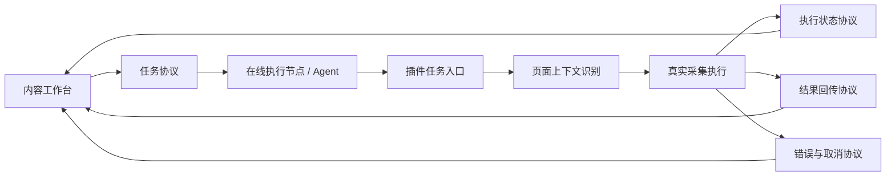

# 插件接入内容工作台前的协议边界收口清单

> 文档类型：插件侧治理清单  
> 更新日期：2026-04-02  
> 目的：明确插件在接入内容工作台前，哪些“消息、任务、状态、结果”边界必须先收口  
> 适用阶段：插件仍为重执行端，内容工作台尚未正式联动

---

## 1. 先说结论

插件现在已经有了“可被远程系统接入”的雏形，但还没有真正长成一个可被稳定调度的执行端。

现状里已经存在的好基础有：

1. 统一消息常量，见 `src/shared/constants.js`
2. 页面上下文查询能力，见 `MSG.GET_PAGE_CONTEXT`
3. 本地任务记录能力，见 `src/db/collectionRunStore.js`
4. 页内任务状态 UI 语义，见 `src/shared/taskUi.js`
5. 抖音和小红书的真实执行链路，已经落在 content / platform 模块里

但这些能力今天仍然偏“插件内部自洽”，还不是“工作台可以稳定调度”的外部协议。

如果现在直接做工作台联动，最容易出现的问题会是：

1. 工作台发了任务，但插件不知道这是不是同一任务的重试
2. 工作台拿到了“成功/失败”，却不知道中间执行到了哪一步
3. 插件采到了数据，但结果结构仍偏本地 Dashboard 视角，不够面向远程消费
4. 页内任务状态和远程任务状态不是一套语义，后面会越接越乱

所以接入前，插件侧必须先把协议边界收口成 8 类。

---

## 2. 总边界图



这张图里，插件真正要先补齐的不是“更多按钮”，而是中间这 5 段：

1. 插件任务入口
2. 页面上下文识别
3. 执行状态协议
4. 结果回传协议
5. 错误与取消协议

---

## 3. 必须收口的 8 类协议边界

## 3.1 任务接入边界

### 当前已有

当前插件已经能接收内部消息动作，例如：

1. `collectSingleNote`
2. `collectSingleComment`
3. `collectAuthor`
4. `startBatchNotes`
5. `startBatchComments`

这些动作已经通过 `src/shared/constants.js` 和 `src/content/messageHandlers.js` 收到统一枚举管理。

### 当前不够的地方

这些动作仍然是“插件内部动作名”，不是“工作台任务协议”。

现在缺少的是一层稳定任务信封，例如：

1. 任务 ID
2. 外部来源
3. 任务类型
4. 参数体
5. 幂等键
6. 期望执行平台
7. 期望执行页面类型

也就是说，今天插件能理解“开始批量评论”，但还不能稳定理解“这是工作台发来的第 3 次重试任务，目标是抖音搜索页，参数版本 v1”。

### 接入前至少收口到

插件侧需要先认一套统一任务信封，建议最小字段如下：

```json
{
  "protocolVersion": "v1",
  "taskId": "wb_task_xxx",
  "taskType": "douyin.batchComments",
  "platform": "douyin",
  "target": {
    "pageType": "search",
    "url": "https://www.douyin.com/search/xxx"
  },
  "payload": {},
  "triggerSource": "workbench_dispatch",
  "idempotencyKey": "xxx",
  "createdAt": "2026-04-02T10:00:00.000Z"
}
```

### 优先级

`P0`。  
没有这层，后面所有工作台联动都会变成“直接往插件里塞动作名”。

---

## 3.2 页面能力握手边界

### 当前已有

插件已经具备页面上下文查询能力，见：

1. `src/content/contentDataRuntime.js`
2. `src/content/messageHandlers.js`
3. `MSG.GET_PAGE_CONTEXT`

当前已经能返回：

1. `platform`
2. `mode`
3. `pageType`
4. `url`
5. `isStableSearchList`
6. `capabilities`

这是非常重要的现成基础。

### 当前不够的地方

现在这层返回结果更偏 Popup 用，不足以成为“工作台派单前校验”协议。

主要差口有：

1. 没有 `contextVersion`
2. 没有明确“为什么不可执行”的原因码
3. 没有区分“暂时不可执行”和“永久不支持”
4. 没有暴露“当前插件实例可执行哪些任务类型”

### 接入前至少收口到

页面能力握手建议返回四类信息：

1. 页面身份：平台、页面类型、URL、稳定性
2. 能力矩阵：当前支持哪些任务
3. 拒绝原因：为什么现在不能执行
4. 执行建议：是否需要先进入详情页、先滚出稳定列表、先登录

建议最小返回形态：

```json
{
  "contextVersion": "v1",
  "platform": "douyin",
  "pageType": "search",
  "url": "https://www.douyin.com/search/xxx",
  "capabilities": {
    "canRunTaskTypes": [
      "douyin.batchNotes",
      "douyin.batchComments"
    ]
  },
  "readiness": {
    "ready": false,
    "reasonCode": "search_list_unstable",
    "reasonMessage": "搜索结果列表尚未形成稳定可遍历状态"
  }
}
```

### 优先级

`P0`。  
这是“工作台能不能派单”和“插件能不能拒单”的边界。

---

## 3.3 执行生命周期边界

### 当前已有

插件已经有本地任务状态语义：

1. `idle`
2. `running`
3. `paused`
4. `stopping`
5. `done`
6. `error`

定义见 `src/shared/constants.js`。  
页内任务栏和 Popup 的状态显示也已经在围绕这套语义运行。

### 当前不够的地方

这套状态今天还是“面向 UI”，还不是“面向远程任务系统”的执行生命周期。

缺的不是状态名，而是几个关键节点：

1. `accepted`
2. `rejected`
3. `queued`
4. `started`
5. `heartbeat`
6. `partial_success`
7. `canceled`

否则工作台只能看到“开始跑了”或者“跑完了”，中间几乎是黑盒。

### 接入前至少收口到

建议插件侧把生命周期拆成两层：

1. 执行态：`accepted / running / paused / stopping / done / failed / canceled`
2. 阶段态：`context_check / discovering / collecting / downloading / persisting / uploading / finalizing`

这样后面既能给用户看，也能给工作台看。

### 优先级

`P0`。  
不先统一生命周期，后面任务历史和团队视图一定会失真。

---

## 3.4 进度与心跳边界

### 当前已有

插件已经会发进度消息，Popup 里也在消费 `MSG.PROGRESS`；页内任务栏也已经围绕当前步骤和进度条更新。

### 当前不够的地方

当前进度更像“给人看”，不够“给系统消费”。

现在缺的主要是：

1. 固定进度结构
2. 心跳时间戳
3. 进度阶段码
4. 可聚合的计数项
5. 最近错误信息

如果未来工作台要展示“远程在线节点正在做什么”，这层必须结构化。

### 接入前至少收口到

建议统一为固定进度事件：

```json
{
  "taskId": "wb_task_xxx",
  "status": "running",
  "stage": "collecting",
  "current": 12,
  "total": 30,
  "message": "正在采集第 12 条视频",
  "metrics": {
    "discovered": 30,
    "collected": 12,
    "failed": 1
  },
  "heartbeatAt": "2026-04-02T10:05:00.000Z"
}
```

### 优先级

`P0`。  
这是远程任务可观测性的底线。

---

## 3.5 结果回传边界

### 当前已有

插件本地已经有比较成熟的数据层，见：

1. `src/db/noteStore.js`
2. `src/db/commentStore.js`
3. `src/db/authorStore.js`
4. `src/db/mediaAssetStore.js`
5. `src/db/recordNormalization.js`

而且记录里已经有很多对远程消费友好的字段，例如：

1. `platform`
2. `contentId / noteId / commentId / authorId`
3. `collectionRunId`
4. `triggerSource`
5. `rawPayload`

### 当前不够的地方

今天的数据结构虽然已经比普通插件成熟，但还是偏“本地落库 + Dashboard 查看”。

缺口主要在：

1. 没有正式的远程结果包
2. 没有区分“本轮新增”和“历史已有”
3. 没有统一声明结果包含哪些实体
4. 没有明确媒体文件与结构化记录的关系

### 接入前至少收口到

插件侧需要能输出统一结果包，而不是只返回“成功，采了 20 条”。

建议最小结果结构：

```json
{
  "taskId": "wb_task_xxx",
  "collectionRunId": "batchComments_xxx",
  "platform": "douyin",
  "resultSummary": {
    "notes": 10,
    "comments": 286,
    "authors": 1,
    "mediaAssets": 12
  },
  "records": {
    "notes": [],
    "comments": [],
    "authors": [],
    "mediaAssets": []
  }
}
```

后续如果结果太大，再拆成：

1. 摘要包
2. 分片数据包
3. 媒体资产清单

### 优先级

`P0`。  
没有结果包，工作台就只能接“任务日志”，接不住真正的数据资产。

---

## 3.6 错误、拒绝、取消边界

### 当前已有

当前插件会通过异常和错误消息返回失败，也已经存在批量暂停、继续、停止等能力。

### 当前不够的地方

今天错误仍然偏“字符串报错”，不够协议化。

缺口主要有：

1. 没有统一错误码
2. 没有拒绝执行码
3. 没有“可重试 / 不可重试”标记
4. 没有“用户取消”和“系统失败”的清晰区分

未来如果工作台要做自动重试或失败复盘，这层必须结构化。

### 接入前至少收口到

建议统一错误结构：

```json
{
  "taskId": "wb_task_xxx",
  "status": "failed",
  "error": {
    "code": "page_context_unavailable",
    "message": "当前页面未形成可执行上下文",
    "retryable": true,
    "category": "context"
  }
}
```

至少先覆盖 5 类错误：

1. 页面上下文错误
2. 登录态错误
3. 页面风控或接口拒绝
4. 数据写入错误
5. 用户主动停止

### 优先级

`P0`。  
没有错误分类，工作台后面没法做自动处理。

---

## 3.7 本地运行记录与远程任务映射边界

### 当前已有

`src/db/collectionRunStore.js` 已经是非常好的基础。  
当前它已经能记录：

1. `collectionRunId`
2. `platform`
3. `taskType`
4. `pageType`
5. `triggerSource`
6. `status`
7. `config`
8. `meta`
9. `startedAt / updatedAt / finishedAt`

### 当前不够的地方

现在它还是本地运行记录，还没和未来工作台任务正式打通。

最关键的缺口有：

1. 没有 `externalTaskId`
2. 没有 `dispatcher`
3. 没有 `executorInstanceId`
4. 没有 `protocolVersion`
5. 没有 `remoteSyncStatus`

### 接入前至少收口到

插件本地运行记录必须升级成“可映射远程任务”的执行记录。

建议在 `collectionRuns` 的未来字段中至少预留：

1. `externalTaskId`
2. `externalTaskType`
3. `executorInstanceId`
4. `resultUploadStatus`
5. `lastHeartbeatAt`

### 优先级

`P1`。  
不是第一步最先改，但必须在正式联调前落地。

---

## 3.8 协议版本与兼容边界

### 当前已有

当前插件消息常量做得比较清楚，但没有正式的协议版本概念。

### 当前不够的地方

一旦工作台和插件开始独立演进，就会立刻出现：

1. 字段加了，老插件不认识
2. 工作台按新字段派单，旧插件误接
3. 结果结构变了，工作台解析错

### 接入前至少收口到

至少要先约定 3 件事：

1. 每个外部任务信封都带 `protocolVersion`
2. 每个能力握手都返回 `supportedProtocolVersions`
3. 每个结果包都声明自己的 `schemaVersion`

### 优先级

`P1`。  
第一版不做复杂兼容也可以，但必须先把版本口子留出来。

---

## 4. 先做什么，后做什么

如果只按“接入内容工作台前的最小闭环”来排，插件侧建议顺序如下：

1. `P0` 先定义统一任务信封
2. `P0` 把页面能力握手改成正式协议
3. `P0` 把执行生命周期和进度事件结构化
4. `P0` 把结果回传结构从“本地结果”收口成“远程结果包”
5. `P0` 把错误与取消统一成错误码体系
6. `P1` 再升级 `collectionRuns`，让本地记录能映射远程任务
7. `P1` 最后补协议版本和兼容机制

---

## 5. 对当前代码的直接判断

从代码现实看，这个插件不是“还得从零设计协议”，而是“已经有半套内部协议，但还没收口成对外协议”。

换句话说：

1. `MSG` 常量层，是未来外部协议的种子
2. `GET_PAGE_CONTEXT`，是未来能力握手的种子
3. `TASK_STATE` 和 `taskUi`，是未来生命周期协议的种子
4. `collectionRunStore`，是未来任务历史映射的种子
5. `note/comment/author/mediaAsset` 数据层，是未来结果回传协议的种子

这意味着后续最正确的做法不是“另外发明一套全新系统”，而是：

**把现有插件内部协议，逐步收口成工作台可消费的正式协议。**

---

## 6. 本轮建议产出物

基于这份清单，插件侧下一轮最值得马上落地的不是 UI，而是两份正式文档：

1. `任务协议草案`
   - 定义 `task envelope / capability handshake / progress event / result package / error package`
2. `插件侧改造顺序`
   - 明确先改哪些文件，先不改哪些文件

这样后面进入真正联调时，就不会一边接工作台，一边临时猜字段。
