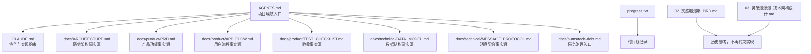

# 2026-03 项目回头看总审查报告

> 审查日期：2026-03-27  
> 审查范围：`/Users/moglenny/proma/小红书插件` + `/Users/moglenny/proma/小红书插件/linggan-boom`  
> 审查方式：文档盘点 + 代码核对 + UI/工作流最佳实践审视  
> 外部审查镜头：`Build Web Apps` / Web Interface Guidelines

---

## 1. 结论先行

这次回头看之后，结论很明确：

1. 项目已经不再是“没有规则”的状态，反而是**规则开始变多**。
2. 真正的问题不是“缺文档”，而是**文档权威关系没有完全收口**，导致一部分文件在指导开发，另一部分文件在拖慢开发。
3. 最近几轮抖音迭代已经证明，项目最有效的经验不是“多写规则”，而是：
   - 先调研再实现
   - 按用户真实操作流建模
   - 采集、下载、面板共享同一上下文
4. 当前项目离“可持续迭代的产品化插件”更近了，但还没到“治理闭环”阶段。最明显的差距有三类：
   - 文档状态落后于代码现实
   - 数据底座声明先进于真实接入程度
   - UI/工作流对非技术用户仍不够友好

本次审查的总判断是：

- **项目治理成熟度**：中等偏上，已经形成骨架，但还没稳定收口
- **产品现实与代码现实一致度**：中等，抖音近几轮成果尚未被权威文档完整接纳
- **AI-ready 数据准备度**：勉强可用，但不够直接支撑长期大模型分析
- **后续优先级建议**：先修治理与文档闭环，再处理最阻塞的结构债

---

## 2. 审查范围与证据

### 2.1 外层项目资料

- `/Users/moglenny/proma/小红书插件/01_小红书数据采集插件_技术逆向分析报告.md`
- `/Users/moglenny/proma/小红书插件/02_灵感爆爆爆_PRD.md`
- `/Users/moglenny/proma/小红书插件/03_灵感爆爆爆_技术架构设计.md`

### 2.2 内层主工程

- 导航/约束：`AGENTS.md`、`CLAUDE.md`、`FRONTEND_GUIDELINES.md`、`BACKEND_STRUCTURE.md`
- 计划/进度：`IMPLEMENTATION_PLAN.md`、`progress.txt`、`docs/plans/**`
- 产品：`docs/product/PRD.md`、`docs/product/APP_FLOW.md`、`docs/product/TEST_CHECKLIST.md`
- 技术：`docs/ARCHITECTURE.md`、`docs/SELECTORS.md`、`docs/technical/**`
- 代码：`src/content/**`、`src/platforms/**`、`src/popup/**`、`src/dashboard/**`、`src/db/**`

### 2.3 关键现实证据

- `src/content/index.js` 当前为 **1545 行**
- `src/platforms/douyin/videoCollector.js` 当前为 **1655 行**
- `src/platforms/douyin/commentCollector.js` 当前为 **710 行**
- `src/dashboard/dashboard.js` 当前为 **583 行**
- `src/popup/popup.js` 当前为 **422 行**
- 当前 Dexie schema 已到 **v6**
- `collectionRuns` 已建表，但 `collectionRunStore` 仅存在 store，**没有业务接入**
- `mediaAssets` 已建表，当前主要只在抖音评论图片区链路中使用

---

## 3. 管理文件架构审查

### 3.1 文件归类

| 文件 | 当前角色 | 审查结论 | 说明 |
|------|----------|----------|------|
| `01_小红书数据采集插件_技术逆向分析报告.md` | 外层研究资料 | 历史 | 对理解项目起源仍有价值，但不应继续约束现有实现 |
| `02_灵感爆爆爆_PRD.md` | 外层早期 PRD | 过期候选 | 仍停留在“小红书插件”阶段，已不能代表现状 |
| `03_灵感爆爆爆_技术架构设计.md` | 外层早期架构 | 过期候选 | 文件结构、权限、数据层描述均明显落后 |
| `AGENTS.md` | 项目地图 | 权威 | 适合作为项目导航与入口 |
| `CLAUDE.md` | AI 会话行为约束 | 权威 | 对最近几轮开发约束力真实存在 |
| `FRONTEND_GUIDELINES.md` | UI 规范摘要 | 辅助 | 能约束风格，但还不足以覆盖可访问性与交互细节 |
| `BACKEND_STRUCTURE.md` | 本地数据层说明 | 过期候选 | 仍写 schema v4，与 v6 现实脱节 |
| `IMPLEMENTATION_PLAN.md` | 总计划 | 过期候选 | 抖音阶段状态明显落后于真实进度 |
| `progress.txt` | 进度日志 | 辅助 | 有价值，但已出现时效漂移，不应作为事实源 |
| `docs/ARCHITECTURE.md` | 真实系统架构说明 | 权威 | 当前最接近代码现实的架构文档 |
| `docs/product/PRD.md` | 当前产品承诺 | 权威 | 应该是产品事实源，但目前抖音部分落后 |
| `docs/product/APP_FLOW.md` | 用户操作流 | 权威 | 应该约束交互，但当前抖音流程已滞后 |
| `docs/product/TEST_CHECKLIST.md` | 验收基线 | 权威 | 价值高，但抖音部分需要继续细化 |
| `docs/technical/DATA_MODEL.md` | 当前 schema 描述 | 权威 | 已反映 v6，但与真实接线程度仍需补充 |
| `docs/technical/MESSAGE_PROTOCOL.md` | 消息契约 | 权威 | 现在已经落后于真实 payload |
| `docs/plans/tech-debt.md` | 债务看板 | 权威 | 有效，但部分结论已需要修订 |

### 3.2 文档权威关系图

### 3.3 主要冲突与冗余

1. 外层 `02_*.md`、`03_*.md` 仍保留“项目总体设计”姿态，但内容已经明显过期。
2. `BACKEND_STRUCTURE.md` 写的是 schema v4，`docs/technical/DATA_MODEL.md` 写的是 v6，权威关系没有明说。
3. `IMPLEMENTATION_PLAN.md` 仍把抖音批量与评论放在“待启动/Phase E-2”，与当前代码和实测不符。
4. `progress.txt` 最后更新时间仍是 2026-03-24，但 2026-03-25 到 2026-03-27 的抖音关键进展并未系统收口。
5. `docs/product/PRD.md` 与 `docs/product/APP_FLOW.md` 仍把抖音表述为“单篇为主”，已经低估了当前能力。

### 3.4 审查结论

项目当前最缺的不是“再写新文档”，而是把**权威关系和更新边界**说清楚：

- 外层三份文档应该退位为“项目历史资料”
- 内层 `docs/**` 才是当前事实层
- `AGENTS.md` 必须显式声明哪些文档是 Source of Truth
- `BACKEND_STRUCTURE.md`、`IMPLEMENTATION_PLAN.md`、`APP_FLOW.md` 当前都处于高风险漂移状态

---

## 4. 经验沉淀有效性审查

### 4.1 核心经验有效性判断

| 经验 | 来源 | 结论 | 说明 |
|------|------|------|------|
| 先调研再实现 | `CLAUDE.md` / `AGENTS.md` | 有效 | 最近几轮抖音重建证明，这是最有效的约束之一 |
| 不转嫁技术债给用户 | `CLAUDE.md` | 部分有效 | 方向正确，但此前仍出现过“用户陪测过多”的情况 |
| 先定义验收结果，再开始实现 | `CLAUDE.md 2.1` | 部分有效 | 后期变好，但前几轮抖音循环里执行不稳定 |
| 小步快跑但每步闭环 | `CLAUDE.md 2.1` | 部分有效 | 视频链路已做到，文档闭环没有同步跟上 |
| 黑盒风险前置 | `CLAUDE.md` / `ARCHITECTURE.md` | 有效 | 分享按钮触发采集、评论接口桥接都源于此 |
| 体验稳定性优先于功能堆叠 | `CLAUDE.md 2.1` | 有效 | 这条经验直接推动了抖音从“补丁式”转向“状态化/动作化” |
| 每轮结束更新 `progress.txt` | `CLAUDE.md` / `IMPLEMENTATION_PLAN.md` | 失效 | 规则写了，但实际没有持续执行 |
| 修改外部依赖要同步更新 `SELECTORS.md` | `AGENTS.md` | 部分有效 | 小红书执行较好，抖音更多沉淀到了专项文档 |

### 4.2 最近几轮抖音开发暴露出的经验问题

1. **正确经验被执行晚了**  
   “按用户真实操作流建模”这条经验，真正生效是在引入分享按钮触发之后。

2. **文档沉淀先于行为沉淀**  
   有些规则已经写进 `CLAUDE.md`，但直到连续几轮失败后才真正变成开发动作。

3. **错误的隐性经验曾经在起作用**  
   最典型的是：默认认为“只要多加几层 ID 优先级就能修好抖音当前视频识别”。这类经验没有写进文档，但真实影响了实现路径。

### 4.3 今后必须保留 / 改写 / 删除的经验

#### 必须继续遵守

- 先调研再实现
- 方案先围绕真实用户操作流，而不是先围绕 DOM
- 采集、下载、面板必须共享同一上下文
- 失败采证脚本必须先于大改动

#### 必须改写

- “每轮结束更新 `progress.txt`”需要升级为：  
  只有当 `progress.txt + 对应权威文档 + 计划文档` 同步完成，才算真正闭环

- “改选择器就更新 `SELECTORS.md`”需要扩成：  
  结构化状态、接口字段、桥接协议变更也要同步更新对应技术文档

#### 必须删除或弱化

- 任何“先在旧链路上继续打补丁试试”的隐性默认策略  
  抖音已经证明，这会快速把系统带入循环修复

---

## 5. 产品与功能现实审查

### 5.1 平台 × 功能 × 状态矩阵

| 平台 | 功能 | 当前状态 | 说明 |
|------|------|----------|------|
| 小红书 | 单篇笔记采集 | 已完成 | 主链路稳定 |
| 小红书 | 单篇评论采集 | 已完成 | 含子评论 |
| 小红书 | 博主采集 | 已完成 | 依赖 `__INITIAL_STATE__` |
| 小红书 | 批量笔记采集 | 已完成 | 支持 Top N |
| 小红书 | 批量评论采集 | 已完成 | 串行可控 |
| 小红书 | 评论图片区下载 | 已完成 | 独立能力 |
| 小红书 | Dashboard/导出 | 已完成 | 功能完整 |
| 抖音 | 单条视频采集 | 已完成 | 近期已稳定 |
| 抖音 | 单条视频下载 | 已完成 | 当前可用 |
| 抖音 | 原生分享触发采集 | 已完成 | 是当前最稳的确认动作 |
| 抖音 | 单条博主采集 | 已完成 | 但字段语义仍需继续清理 |
| 抖音 | 单条评论采集 | 部分完成 | 代码已实现，单条产品化体验仍需单独验收 |
| 抖音 | 评论图片区下载 | 部分完成 | 代码已接入，需做完整产品化验收 |
| 抖音 | 批量视频采集 | 已完成 | 已切到作品列表 API 驱动 |
| 抖音 | 批量评论采集 | 已完成 | 已切到作品列表 + 页面桥评论接口 |
| 抖音 | 数据面板二次下载 | 部分完成 | 当前能力已接，但还需长时效回归 |

### 5.2 文档与现实不一致的关键点

#### 文档低估了代码现实

1. `docs/product/PRD.md` 仍写“抖音：批量与评论采集持续开发中”
2. `docs/product/APP_FLOW.md` 仍写“抖音当前以单篇为主”
3. `IMPLEMENTATION_PLAN.md` 仍把抖音批量与评论列为未完成

#### 文档高估了稳定程度

1. `docs/product/TEST_CHECKLIST.md` 中对抖音评论图片区、单条评论产品化体验的验收还不够细
2. `DATA_MODEL.md` 已声明评论树和任务上下文能力，但真实业务接入并未全链路完成

### 5.3 当前下一阶段开发边界

基于现实状态，下一阶段不该再把抖音列为“从零做功能”，而应按下面边界推进：

- 抖音评论能力从“已有实现”进入“完整产品化”
- 抖音评论图片区从“能力接通”进入“完整验收与数据管理”
- 批量能力从“跑通”进入“任务治理、面板治理、数据治理”

---

## 6. 代码架构与技术路径审查

### 6.1 当前最主要的结构风险

1. `src/content/index.js` 已增长到 **1545 行**  
   它同时承担：
   - 消息路由
   - 平台分发
   - 批量任务控制
   - Dashboard 桥接
   - 媒体下载编排  
   这已经不是“稍大”，而是**中心化瓶颈**。

2. `src/platforms/douyin/videoCollector.js` 已增长到 **1655 行**  
   它同时承担：
   - 当前视频上下文解析
   - render/router/api/dom 多源归一
   - 媒体刷新
   - 单条采集
   - 下载前置解析
   - 分享文案处理  
   这意味着抖音主链路现在仍然**过度集中**。

3. `src/platforms/douyin/commentCollector.js` 已经承担：
   - 评论/回复接口
   - 页面桥 fetch
   - 评论树映射
   - 评论图片资产落库
   - 图片下载  
   说明评论能力已经形成第二个复杂中心。

### 6.2 已确认的主要技术债

| 等级 | 问题 | 影响范围 | 现实后果 |
|------|------|----------|----------|
| 阻塞 | `src/content/index.js` 中心化过重 | 所有平台、消息、面板 | 任何新增能力都会继续堆积在单点 |
| 高 | 抖音 `videoCollector.js` 职责过多 | 抖音视频主链路 | 维护成本高，回归容易互相影响 |
| 高 | `MESSAGE_PROTOCOL.md` 落后 | Popup/Content/Background/Dashboard | 文档无法真实指导后续接入 |
| 高 | `BACKEND_STRUCTURE.md` 与 v6 schema 脱节 | 数据层认知 | 会误导后续设计与审查 |
| 高 | `collectionRuns` 已建表但未接入 | AI-ready / 批量任务 | 声明的任务上下文并不存在于真实链路 |
| 中 | `mediaAssets` 只局部接入 | 评论图片区 / 未来媒体治理 | 资产层不完整 |
| 中 | `progress.txt` 未持续收口 | 团队回溯 / 下轮开发 | 时间线与事实脱节 |
| 中 | 决策日志未记录近几轮抖音关键决策 | 架构维护 | 经验无法沉淀成可回放决策 |
| 中 | Dashboard 消息桥与 content handler 各维护一份下载逻辑接口 | 面板下载 | 协议与行为容易漂移 |
| 低 | 外层 02/03 文档仍保留“现行设计”姿态 | 新成员/新智能体入口 | 增加理解成本 |

### 6.3 Review finding 对应问题的真实结论

用户反复给出的 review finding 指向：

- `linggan-boom/src/platforms/douyin/apiInterceptor.js`

但当前真实代码树里**没有这个文件**。结合已审查到的现实，可以得出：

1. 这条 finding 反映的是一个**真实的架构担忧**，不是无效意见。
2. 但它指向的实现路径已经不在当前代码树中。
3. 当前真实生效的是：
   - 页面内 `injected/douyinApiCapture.js`
   - 内容脚本桥接
   - 主动 detail API 补抓
4. 当前真正缺的不是“修这个文件”，而是：
   - 在决策日志里明确写清“后台 webRequest 拦截链路已移除/已替代”
   - 在架构文档里明确当前唯一生效的数据捕获路径

### 6.4 文档与代码现实不一致的重点

1. `MESSAGE_PROTOCOL.md` 中 `START_BATCH_COMMENTS` 仍写 `{ mode, count? }`，但现实已经有 `commentLimit`
2. `BACKEND_STRUCTURE.md` 仍写 schema v4
3. `IMPLEMENTATION_PLAN.md` 仍把抖音批量与评论列为待启动
4. `docs/decisions/index.md` 没有记录近几轮抖音“从 DOM 猜测转向 API/页面桥/分享动作确认”的决策

---

## 7. AI-ready 数据底座审查

### 7.1 当前判断

**当前 AI-ready 程度：勉强可用**

能支撑：

- 内容/评论/作者的基础导出
- 跨平台基础聚合
- 初步给大模型做内容摘要、标签归纳、简单评论聚类

还不能稳定支撑：

- 长期批次级分析
- 评论传播链/对话树分析
- 任务级审计回溯
- 原始证据重算
- 稳定的媒体资产分析

### 7.2 已具备的基础

1. v6 schema 已引入：
   - `contentId`
   - `platformContentId`
   - `authorEntityId`
   - 评论树字段
   - `collectionRuns`
   - `mediaAssets`

2. 抖音评论链路已经开始写：
   - `rootCommentId`
   - `level`
   - `replyToCommentId`
   - `replyToUserName`

3. 抖音评论图片区已经把媒体资产写入 `mediaAssets`

### 7.3 主要缺口

1. **任务上下文未真正接通**  
   `collectionRuns` 有 schema 和 store，但当前没有进入主业务链路。

2. **原始证据层缺失**  
   当前没有系统化存储：
   - `rawPayload`
   - `rawDomText`
   - `collectorVersion`
   - `rawShareText` 之外的结构化原始证据

3. **历史数据回填不完整**  
   文档已明确：并非所有历史记录都补齐了 `contentId / authorEntityId / publishedAt`

4. **评论结构虽入 schema，但未形成统一平台契约**  
   小红书与抖音的评论结构还没有完全按同一分析语义对齐

### 7.4 数据契约路线建议

#### P0

- 让 `collectionRuns` 真正进入批量任务链路
- 给评论采集写稳定的 `collectionRunId`
- 补齐内容、评论、作者的 `collectedAt / publishedAt`

#### P1

- 建立原始证据层
- 明确评论图片与内容媒体的资产归属关系
- 统一 `handle / redId / douyinId` 的展示与导出语义

#### P2

- 历史数据迁移与回填脚本
- 为大模型分析准备更干净的派生字段

---

## 8. Build Web Apps 最佳实践审查

本节使用 `Build Web Apps` 的 Web Interface Guidelines 作为外部镜子，重点看 popup、dashboard 与注入 UI。

### 8.1 关键发现

1. **动态反馈缺少无障碍语义**
   - `src/popup/popup.html:15`
   - `src/popup/popup.html:46-53`
   当前 notice 与 progress 状态是纯视觉更新，没有 `aria-live`。

2. **Popup 对话框不是语义化 dialog**
   - `src/popup/popup.html:62-88`
   批量设置弹层缺少 `role="dialog"` / `aria-modal="true"` / 焦点管理。

3. **Popup 按钮缺少清晰 focus-visible 样式**
   - `src/popup/popup.css:113-127`
   只有 hover，没有键盘焦点可见反馈。

4. **Dashboard 仍大量依赖 `alert` / `confirm`**
   - `src/dashboard/dashboard.js:69-74`
   - `src/dashboard/dashboard.js:233-246`
   这会打断任务流，也不利于复杂状态反馈。

5. **抖音页内动作依赖 `window.prompt` / `window.confirm`**
   - `src/platforms/douyin/index.js:277-280`
   - `src/platforms/douyin/index.js:333-336`
   - `src/platforms/douyin/index.js:360-365`
   这类原生阻塞式交互对于非技术用户不友好，也让流程难以一致化。

6. **抖音页内 toast 和进度条缺少无障碍反馈**
   - `src/platforms/douyin/uiInjector.js:174-211`
   - `src/platforms/douyin/uiInjector.js:217-252`
   视觉反馈做了，但没有 `aria-live`，也没有键盘可见性策略。

### 8.2 UI/工作流层面的结论

当前插件已经有风格一致性，但还没有达到“对非技术用户足够温和”的程度。  
最大的问题不是颜色和排版，而是：

- 任务设置还依赖浏览器原生阻塞弹窗
- 动态状态反馈更多服务于“当前开发者看懂”，而不是“普通用户安心使用”
- Popup、Dashboard、页内注入 UI 各自有反馈机制，但还没有统一的人机交互语言

---

## 9. 总体判断与建议

### 9.1 当前项目最真实的状态

这是一个**已经跨过“脚本工具”阶段、正在进入“产品化插件”阶段**的项目。  
它现在最缺的不是更多能力，而是：

- 把已经做出来的能力收进权威文档
- 把已声明的数据底座真正接进业务链路
- 把 UI/工作流从“能用”推进到“易用”

### 9.2 下一轮优先级建议

#### 第一优先级：先修治理闭环

- 修正权威文档与现实漂移
- 补决策日志
- 更新计划与进度

#### 第二优先级：再修结构阻塞点

- 拆分 `src/content/index.js`
- 把抖音视频上下文解析进一步模块化
- 把 `collectionRuns` 接入批量链路

#### 第三优先级：最后补体验债

- Popup/页内注入交互改为统一设置弹层
- 统一 toast / 进度 / 错误反馈
- 处理可访问性与键盘焦点

---

## 10. 审查结论摘要

| 维度 | 结论 |
|------|------|
| 管理文件架构 | 已有骨架，但权威关系未完全收口 |
| 经验沉淀有效性 | 有几条关键经验已证明有效，但闭环规则执行不稳定 |
| 产品与功能现实 | 抖音现实能力已明显超出文档描述 |
| 代码架构 | 核心能力可用，但中心化文件已成为下一阶段阻塞点 |
| AI-ready 数据底座 | 已起步，但距离真正分析底座仍有明显缺口 |
| UI/工作流最佳实践 | 视觉一致性尚可，交互成熟度仍偏工程化 |

本次审查后的推荐路线不是“继续直接加功能”，而是：

**先做治理闭环修复，再进入下一轮功能开发。**
