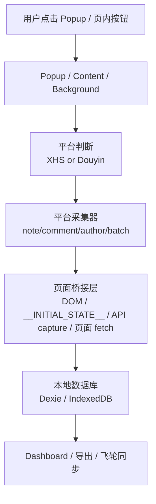

# 灵感爆爆爆 插件代码地图与技术路径

> 文档类型：插件侧代码梳理  
> 更新日期：2026-04-02  
> 目的：帮助接手人快速理解“代码放在哪里、真正怎么跑、数据怎么流”

---

## 1. 先用一句话看懂代码结构

这个插件现在不是“一坨脚本”，而是一个已经分成 4 个入口、2 个平台、5 层职责的 Chrome MV3 扩展：

```text
Popup / Dashboard / 页内按钮
  → Content Script / Background
    → XHS / Douyin 平台模块
      → 页面桥接 / API 捕获 / 页面侧 fetch
        → Dexie / IndexedDB 本地数据层
```

它的真实重心不是 `background`，而是：

1. `src/content/index.js`
2. `src/platforms/douyin/*`
3. `src/popup/popup.js`
4. `src/content/contentDataRuntime.js`

---

## 2. 构建入口是什么

当前 webpack 有 4 个正式入口，见 `webpack.config.js`：

| 入口 | 文件 | 作用 |
|------|------|------|
| `content` | `src/content/index.js` | 页面内总入口，真正驱动大部分业务 |
| `background` | `src/background/index.js` | 后台调度、下载、消息转发、角标、配置 |
| `popup` | `src/popup/popup.js` | 浏览器弹窗总控台 |
| `dashboard` | `src/dashboard/dashboard.js` | 数据面板 |

这意味着项目不是一个单页面插件，而是 4 个并行运行的子应用。

---

## 3. 目录到底各负责什么

### 3.1 `src/popup/`

这是**用户发任务的总控层**。

它负责：

- 判断当前平台和页面类型
- 告诉用户“当前页能做什么”
- 发起单条任务、批量任务、数据面板、飞轮同步
- 显示统一任务状态

它不负责真正采数据，只负责：

- 决定按钮是否可点
- 把任务指令发出去

### 3.2 `src/content/`

这是**页面内的总入口层**，也是当前项目最关键的一层。

它负责：

- 插件注入到网页后最先执行
- 判断当前是不是抖音页面
- 把小红书和抖音两套业务接起来
- 接收来自 Popup / Background / Dashboard 的消息
- 提供 Dashboard 的页面桥接

这里当前的真实入口是：

- 小红书：`xhsPageController`
- 抖音：按需加载 `douyinRuntime`

### 3.3 `src/platforms/xhs/`

这是**小红书业务层**。

包括：

- 笔记采集
- 评论采集
- 博主采集
- 批量笔记
- 批量评论
- UI 注入
- 页面检测
- 反检测

小红书当前整体已经比较稳定，结构上也比抖音更简单。

### 3.4 `src/platforms/douyin/`

这是**抖音业务层**，也是当前最复杂、最重的一层。

包括：

- 当前视频识别
- 视频采集
- 视频下载
- 评论采集
- 评论图片区下载
- 博主采集
- 批量视频
- 批量评论
- 页面类型识别
- 页内 UI 注入
- 作品列表发现

抖音复杂的原因不是代码写法，而是网站本身是：

- SPA
- 弹层态复用 DOM
- URL、页面状态、接口返回会错峰更新

### 3.5 `src/injected/`

这是**页面桥接层**。

它运行在网页自己的主世界里，负责拿到 Content Script 直接拿不到的东西。

当前最重要的是：

- `noteMap.js`：小红书读 `__INITIAL_STATE__`
- `douyinApiCapture.js`：抖音拦截页面 fetch/XHR，捕获 detail / feed / profile 数据

### 3.6 `src/db/`

这是**本地数据层**。

它现在不是简单存表，而是已经形成了完整结构：

- `notes`
- `comments`
- `authors`
- `collectionRuns`
- `mediaAssets`

并且已经有“运行时标准化”能力，不是裸写数据库。

### 3.7 `src/background/`

这是**后台调度层**。

它的职责很明确：

- 下载媒体
- 转发批量任务消息
- 管角标 badge
- 派发 Esc
- 保存飞轮配置

Background 不是业务核心，但它是不可缺的中转层。

### 3.8 `src/dashboard/`

这是**数据查看和管理层**。

负责：

- 看笔记 / 评论 / 博主数据
- 搜索、筛选、导出
- 删除和清空
- 触发二次下载

### 3.9 `src/shared/`

这是**共享协议层**。

负责：

- 消息常量
- 消息封装
- 任务 UI 语义
- 通用工具函数

---

## 4. 现在真正的核心文件有哪些

### 第一梯队：真正的核心枢纽

| 文件 | 作用 | 当前风险 |
|------|------|----------|
| `src/content/index.js` | 内容入口、平台分流、消息总入口 | 仍偏胖，是系统枢纽 |
| `src/popup/popup.js` | 用户任务入口和页面能力判断 | 持续变胖 |
| `src/background/index.js` | 后台消息与下载调度 | 稳定，但属于关键中转点 |
| `src/content/contentDataRuntime.js` | 数据桥、消息处理、Dashboard 支撑 | 已成中枢 |
| `src/platforms/douyin/index.js` | 抖音平台主控制器 | 明显偏胖 |

### 第二梯队：强业务文件

| 文件 | 作用 |
|------|------|
| `src/content/xhsPageController.js` | 小红书页内动作总控制器 |
| `src/platforms/douyin/videoCollector.js` | 抖音视频采集核心 |
| `src/platforms/douyin/commentCollector.js` | 抖音评论与评论图片区核心 |
| `src/platforms/douyin/batchController.js` | 抖音批量视频 / 批量评论核心 |
| `src/content/messageHandlers.js` | Popup / Dashboard / Background 真正调用的业务处理器 |

### 第三梯队：重要辅助层

| 文件 | 作用 |
|------|------|
| `src/platforms/douyin/pageDetector.js` | 抖音页面类型识别 |
| `src/injected/douyinApiCapture.js` | 抖音 API 捕获 |
| `src/db/recordNormalization.js` | 历史数据与多平台记录标准化 |
| `src/shared/taskUi.js` | 页内统一任务控制台语义 |

---

## 5. 代码真实怎么跑

## 5.1 插件加载到网页时

真正发生的是：

1. `content/index.js` 启动
2. 判断当前是不是抖音
3. 如果是抖音，就按需加载 `douyinRuntime`
4. 如果不是抖音，就默认走小红书控制器
5. 同时注册来自 Popup / Dashboard / Background 的消息监听

也就是说：

- **Content 是真正的业务宿主**
- 不是 Popup 在做业务
- 也不是 Background 在做业务

## 5.2 你在 Popup 里点“采集当前内容”时

真实链路是：

```text
Popup
  → sendToTab
    → Content messageHandlers
      → 平台采集器
        → 页面桥接 / API / DOM
          → noteStore / commentStore / authorStore
```

例如：

- 小红书单篇笔记：`popup -> COLLECT_SINGLE_NOTE -> collectNote -> noteStore`
- 抖音当前视频：`popup -> COLLECT_SINGLE_NOTE -> collectDouyinVideo -> noteStore`

## 5.3 你点“批量任务”时

真实链路是：

```text
Popup
  → Background
    → Content
      → batchMessageHandlers
        → 平台批量控制器
          → collectionRunStore + note/comment store
```

这里多一层 Background 的原因是：

- 批量任务需要后台转发
- 还要顺手更新 badge
- 也更方便后面走统一调度

## 5.4 你打开 Dashboard 时

真实链路是：

```text
Popup
  → Content toggleDashboard
    → Dashboard iframe
      ↔ contentDataRuntime.dashboardBridge
        ↔ note/comment/author store
```

Dashboard 不是直接读 IndexedDB，而是通过 Content 提供的桥拿数据。

这点很重要，因为：

- Dashboard 运行在扩展页
- 页面数据上下文在 Content 那边

## 5.5 你点“飞轮同步”时

真实链路不是 Background 直接读库，而是：

```text
Popup
  → 内容页面
    → 从页面上下文读取数据
      → 映射结构
        → POST 到飞轮工作台
```

所以现在飞轮同步本质上还是：

- **页面发起**
- **Background 只管配置**

---

## 6. 小红书和抖音的技术路径为什么不同

### 6.1 小红书

小红书现在的主路径是：

```text
页面结构化状态（__INITIAL_STATE__）
  + DOM 交互
  + 页面跳转/返回
```

特点：

- 结构相对稳定
- 详情页语义清楚
- 批量任务主要靠页面扫描和打开详情页执行

### 6.2 抖音

抖音现在的主路径是：

```text
页面状态识别
  + 作品列表 API
  + 评论 / 回复接口
  + 页面桥接 fetch
  + API capture
  + DOM 兜底
```

特点：

- 不能只靠 DOM
- 不能只靠 URL
- 必须先确认“当前视频上下文”
- 批量任务更偏接口驱动

这就是为什么抖音模块比小红书重得多。

---

## 7. 数据层现在是什么状态

本地数据库已经不只是“临时缓存”，而是插件自己的本地资产层。

### 当前 5 张主表

| 表 | 作用 |
|----|------|
| `notes` | 跨平台内容主表 |
| `comments` | 评论与回复 |
| `authors` | 博主资料 |
| `collectionRuns` | 任务记录 |
| `mediaAssets` | 媒体资产 |

### 当前一个重要特点

写入和读取不是裸操作，而是经过 `recordNormalization.js` 标准化。

这意味着：

- 历史数据和新数据会在读写时尽量对齐
- 多平台字段正在被逐步收口
- 未来要接工作台时，这层会非常重要

---

## 8. 现在的“技术路径图”

### 8.1 总路径



### 8.2 当前真正的分层

```text
用户入口层
  Popup / 页内按钮 / Dashboard

扩展容器层
  Content / Background

平台业务层
  platforms/xhs/*
  platforms/douyin/*

页面桥接层
  injected/*

数据层
  db/*

共享协议层
  shared/*
```

---

## 9. 代码结构现在最真实的判断

### 9.1 已经成型的部分

1. **多平台方向已经成型**
   小红书和抖音已经不是硬写在一起。

2. **本地数据层已经成型**
   不是简单数组缓存，而是正式本地数据库。

3. **批量任务模型已经成型**
   已经有 `collectionRuns` 和批量控制器，不只是单次点击脚本。

4. **Dashboard 已经成型**
   它不是简单表格，而是正式管理面板。

### 9.2 还没完全成型的部分

1. **平台抽象还没彻底收口**
   `contentRouter` / `PlatformAdapter` 已存在，但 `content/index.js` 仍是手写主分流。

2. **几个中心文件正在重新变胖**
   尤其是：
   - `src/content/index.js`
   - `src/popup/popup.js`
   - `src/platforms/douyin/index.js`
   - `src/dashboard/dashboard.js`

3. **结果 envelope 还没统一**
   现在还没有完全统一成 `{ success, data, error }`

4. **还没进入“被工作台调度”的阶段**
   当前还是本地强执行插件，不是在线执行节点

---

## 10. 从接手开发视角，最应该记住什么

### 不要误判的 5 件事

1. **不要以为 Background 是主系统**
   业务主系统其实在 Content。

2. **不要以为 Popup 真正在采集**
   Popup 只是发命令和做能力判断。

3. **不要以为抖音和小红书复杂度一样**
   抖音复杂度明显更高。

4. **不要以为 Dashboard 可以直接替代页面上下文**
   Dashboard 只是管理层，不是执行层。

5. **不要以为 contentRouter 已经接管全局**
   它还只是半成品抽象。

### 接下来最重要的治理方向

1. 守住平台分层，不要再回到跨平台混写
2. 守住加载边界，不要把大模块重新静态打回首包
3. 继续给 `popup.js`、`content/index.js`、`douyin/index.js` 减压
4. 为未来“工作台下发任务 -> 插件执行 -> 结果回传”预留协议边界

---

## 11. 当前一句话结论

这套插件代码现在已经是：

**一个本地优先、双平台、强执行、带本地数据层和管理面板的 Chrome 采集工作台。**

它已经不是“脚本集合”，但也还没完全长成“可被远程调度的执行节点”。
