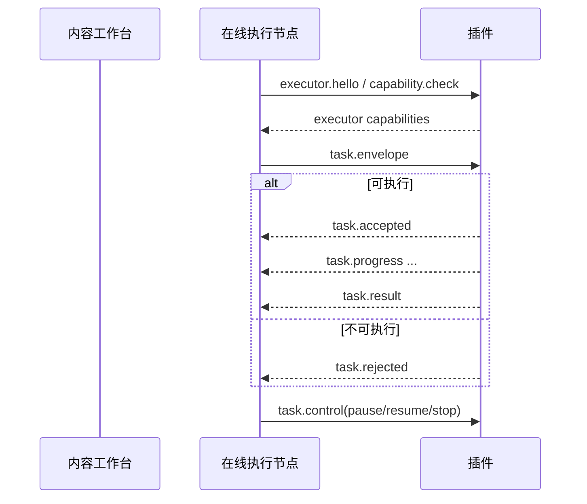

# 插件接入内容工作台任务协议草案 v1

> 文档类型：插件侧协议草案  
> 更新日期：2026-04-02  
> 目的：为“内容工作台 -> 在线执行节点 -> 插件”建立第一版可联调的任务协议  
> 当前状态：草案，尚未落代码  
> 范围限制：只定义插件侧对外协议，不定义内容工作台后端实现细节

---

## 1. 这份草案解决什么问题

在未来目标里：

1. 内容工作台负责发任务
2. 在线执行节点负责把任务交给插件
3. 插件负责在真实网页里执行采集
4. 执行状态和结果要回到工作台

当前插件已经有很成熟的内部动作，但那些动作还主要服务于：

1. Popup
2. Background
3. Dashboard
4. 页内按钮

所以这份协议草案要解决的，不是“重新发明采集逻辑”，而是：

**把插件内部动作，包成一套对工作台和执行节点友好的外部协议。**

---

## 2. 推荐方案

我建议采用下面这条路线：

**外部任务协议包裹内部消息总线。**

也就是：

1. 外部世界只和“任务协议”打交道
2. 插件收到外部任务后，再映射到当前的 `MSG.*` 和平台执行器
3. 插件的内部动作名不直接暴露给工作台

### 为什么推荐这条

因为插件现在已经有这些稳定基础：

1. [constants.js](/Users/moglenny/proma/选题插件-打磨中/linggan-boom/src/shared/constants.js)
2. [messageHandlers.js](/Users/moglenny/proma/选题插件-打磨中/linggan-boom/src/content/messageHandlers.js)
3. [contentDataRuntime.js](/Users/moglenny/proma/选题插件-打磨中/linggan-boom/src/content/contentDataRuntime.js)
4. [collectionRunStore.js](/Users/moglenny/proma/选题插件-打磨中/linggan-boom/src/db/collectionRunStore.js)

如果直接把工作台接到这些内部动作名上，短期快，长期一定会把插件内部实现冻结死。

### 不推荐的两条路

**方案 A：工作台直接发 `MSG.START_BATCH_COMMENTS` 这类内部动作**

- 优点：最快
- 缺点：工作台直接耦合插件内部实现，后面一改动作名就炸

**方案 B：彻底重做一套 RPC 执行框架，替换现有消息体系**

- 优点：理论上最整洁
- 缺点：成本太高，且会破坏当前已经稳定的 Popup / Content / Background 协作

### 推荐结论

保留插件现有内部消息体系，新增一层“外部任务协议适配层”。

---

## 3. 协议设计原则

第一版协议建议遵守 6 条原则：

1. **外部稳定，内部可演进**
   - 工作台看到的是稳定任务协议，不是内部动作名
2. **显式任务，不猜上下文**
   - 每个任务都必须带任务类型、目标平台、目标页面和参数
3. **先握手，再执行**
   - 插件必须先判断当前页面能不能执行，再决定接单还是拒单
4. **状态结构化，不靠文案猜**
   - 进度、失败、完成都必须有结构字段
5. **结果可远程消费**
   - 不能只返回“成功采了 20 条”，而要返回摘要和记录
6. **兼容本地执行历史**
   - 未来远程任务必须能映射回本地 `collectionRuns`

---

## 4. 协议对象总览

第一版建议定义 8 类对象：

1. `executor.hello`
2. `task.envelope`
3. `task.accepted`
4. `task.rejected`
5. `task.progress`
6. `task.result`
7. `task.failed`
8. `task.control`

它们的关系如下：



---

## 5. 执行节点握手协议

## 5.1 `executor.hello`

用途：

1. 标识当前在线插件实例是谁
2. 它支持哪些平台和哪些协议版本
3. 它当前是否在线、空闲、繁忙

建议结构：

```json
{
  "type": "executor.hello",
  "protocolVersion": "v1",
  "executorInstanceId": "macbook-moglenny-chrome-001",
  "pluginVersion": "0.0.0-local",
  "supportedProtocolVersions": ["v1"],
  "platforms": ["xhs", "douyin"],
  "capabilities": {
    "supportsRemoteDispatch": true,
    "supportsPauseResumeStop": true,
    "supportsResultUpload": false
  },
  "runtime": {
    "status": "idle",
    "activeTaskId": "",
    "lastSeenAt": "2026-04-02T12:00:00.000Z"
  }
}
```

### 插件侧对应现实

今天代码里还没有正式的 `executor.hello`，但它未来最自然的落点会是：

1. 一个新的执行节点适配层
2. 复用 [contentDataRuntime.js](/Users/moglenny/proma/选题插件-打磨中/linggan-boom/src/content/contentDataRuntime.js) 的页面能力检查
3. 复用 [collectionRunStore.js](/Users/moglenny/proma/选题插件-打磨中/linggan-boom/src/db/collectionRunStore.js) 的活跃任务记录

---

## 6. 外部任务信封

## 6.1 `task.envelope`

这是第一版最核心的对象。

建议结构：

```json
{
  "type": "task.envelope",
  "protocolVersion": "v1",
  "taskId": "wb_task_20260402_001",
  "taskType": "douyin.batchComments",
  "platform": "douyin",
  "target": {
    "pageType": "search",
    "url": "https://www.douyin.com/search/%E6%95%B0%E5%AD%A6"
  },
  "payload": {
    "limit": 30,
    "sortMode": "hot",
    "commentDepthMode": "twoLevel"
  },
  "triggerSource": "workbench_dispatch",
  "idempotencyKey": "wb_task_20260402_001_v1",
  "createdAt": "2026-04-02T12:00:00.000Z",
  "meta": {
    "requestedBy": "owner_001",
    "workspaceId": "workspace_default"
  }
}
```

### 第一版任务类型建议

先只定义和现有插件最匹配的几类：

1. `xhs.batchNotes`
2. `xhs.batchComments`
3. `xhs.collectAuthor`
4. `douyin.batchNotes`
5. `douyin.batchComments`
6. `douyin.collectAuthor`
7. `douyin.commentImageDownload`

第一版不建议先把“所有单条动作”都塞进远程任务协议。  
远程派单最值钱的，优先是批量任务和博主任务。

### 为什么任务信封要这样设计

因为插件现在已经有这些隐含字段需求：

1. `platform`
2. `pageType`
3. `triggerSource`
4. `collectionRunId`
5. `commentDepthMode`
6. `sortMode`

这些字段已经零散地出现在现有逻辑里，只是还没被提升成正式外部协议。

---

## 7. 页面能力检查与接单/拒单

## 7.1 `capability.check`

在线执行节点下发任务前，插件必须先做能力检查。

建议最小输入：

```json
{
  "type": "capability.check",
  "protocolVersion": "v1",
  "taskType": "douyin.batchComments",
  "platform": "douyin",
  "target": {
    "pageType": "search",
    "url": "https://www.douyin.com/search/%E6%95%B0%E5%AD%A6"
  }
}
```

## 7.2 `capability.report`

建议最小输出：

```json
{
  "type": "capability.report",
  "protocolVersion": "v1",
  "platform": "douyin",
  "pageType": "search",
  "url": "https://www.douyin.com/search/%E6%95%B0%E5%AD%A6",
  "readiness": {
    "ready": true,
    "reasonCode": "",
    "reasonMessage": ""
  },
  "capabilities": {
    "canRunTaskTypes": [
      "douyin.batchNotes",
      "douyin.batchComments"
    ]
  },
  "contextSnapshot": {
    "isStableSearchList": true,
    "isDetailPage": false
  }
}
```

### 插件侧对应现实

这一层几乎可以直接建立在现有 `MSG.GET_PAGE_CONTEXT` 上。  
所以第一版最合理的做法不是重写，而是：

1. 把当前 Popup 在用的页面上下文结构升级成正式协议输出
2. 增补 `reasonCode / canRunTaskTypes / contextVersion`

---

## 8. 接单与拒单事件

## 8.1 `task.accepted`

建议结构：

```json
{
  "type": "task.accepted",
  "protocolVersion": "v1",
  "taskId": "wb_task_20260402_001",
  "executorInstanceId": "macbook-moglenny-chrome-001",
  "collectionRunId": "batchComments_xxx",
  "acceptedAt": "2026-04-02T12:01:00.000Z",
  "status": "accepted"
}
```

这一步会把远程任务和本地 `collectionRuns` 正式绑定起来。

## 8.2 `task.rejected`

建议结构：

```json
{
  "type": "task.rejected",
  "protocolVersion": "v1",
  "taskId": "wb_task_20260402_001",
  "rejectedAt": "2026-04-02T12:01:00.000Z",
  "reason": {
    "code": "search_list_unstable",
    "message": "搜索结果列表尚未形成稳定状态",
    "retryable": true,
    "category": "context"
  }
}
```

### 第一版建议的拒绝码

1. `unsupported_task_type`
2. `platform_mismatch`
3. `page_type_mismatch`
4. `page_context_unavailable`
5. `search_list_unstable`
6. `login_required`
7. `executor_busy`

---

## 9. 任务进度事件

## 9.1 `task.progress`

建议结构：

```json
{
  "type": "task.progress",
  "protocolVersion": "v1",
  "taskId": "wb_task_20260402_001",
  "collectionRunId": "batchComments_xxx",
  "status": "running",
  "stage": "collecting",
  "current": 12,
  "total": 30,
  "message": "正在采集第 12 条视频的评论",
  "metrics": {
    "discovered": 30,
    "collectedNotes": 12,
    "collectedComments": 186,
    "failed": 1
  },
  "heartbeatAt": "2026-04-02T12:05:00.000Z"
}
```

### 第一版建议的阶段枚举

1. `context_check`
2. `discovering`
3. `collecting`
4. `downloading`
5. `persisting`
6. `packaging`
7. `finalizing`

### 插件侧对应现实

当前 Popup 和页内任务条已经有进度和状态语义。  
下一步不是重造 UI，而是把这套进度数据在发送时统一成固定结构。

---

## 10. 任务控制协议

## 10.1 `task.control`

用于远程对已接单任务做暂停、继续、停止。

建议结构：

```json
{
  "type": "task.control",
  "protocolVersion": "v1",
  "taskId": "wb_task_20260402_001",
  "action": "pause",
  "issuedAt": "2026-04-02T12:06:00.000Z"
}
```

### 第一版允许的动作

1. `pause`
2. `resume`
3. `stop`

### 插件侧对应现实

这一层最适合复用现有批量任务控制语义：

1. `pauseBatchNotes`
2. `resumeBatchNotes`
3. `stopBatchNotes`
4. `pauseBatchComments`
5. `resumeBatchComments`
6. `stopBatchComments`

也就是说，外部 `task.control` 不直接等于内部动作名，而是由任务适配层按 `taskType` 映射。

---

## 11. 任务结果包

## 11.1 `task.result`

第一版结果包不建议一上来只回摘要，也不建议直接把整库全推上去。  
建议采用“摘要 + 本轮记录”的结构。

建议最小结构：

```json
{
  "type": "task.result",
  "protocolVersion": "v1",
  "taskId": "wb_task_20260402_001",
  "collectionRunId": "batchComments_xxx",
  "status": "done",
  "completedAt": "2026-04-02T12:10:00.000Z",
  "resultSummary": {
    "notes": 10,
    "comments": 286,
    "authors": 1,
    "mediaAssets": 12
  },
  "records": {
    "notes": [],
    "comments": [],
    "authors": [],
    "mediaAssets": []
  }
}
```

### 为什么结果包要分两层

因为你已经明确需要两层数据能力：

1. 原始数据层
2. 后续资料库 / 选题库加工层

所以插件结果包必须能提供真正的原始记录，而不只是“统计数”。

### 结果包里的记录字段从哪里来

第一版不建议重新定义一套完全新的记录字段。  
更稳的路径是：

1. 以 [recordNormalization.js](/Users/moglenny/proma/选题插件-打磨中/linggan-boom/src/db/recordNormalization.js) 的标准化结果为基础
2. 以 [noteStore.js](/Users/moglenny/proma/选题插件-打磨中/linggan-boom/src/db/noteStore.js)、[commentStore.js](/Users/moglenny/proma/选题插件-打磨中/linggan-boom/src/db/commentStore.js)、[authorStore.js](/Users/moglenny/proma/选题插件-打磨中/linggan-boom/src/db/authorStore.js)、[mediaAssetStore.js](/Users/moglenny/proma/选题插件-打磨中/linggan-boom/src/db/mediaAssetStore.js) 实际落库字段为准

### 第一版建议的摘要统计字段

1. `discoveredNotes`
2. `collectedNotes`
3. `collectedComments`
4. `collectedAuthors`
5. `resolvedMediaAssets`
6. `downloadedMediaAssets`
7. `failedItems`

---

## 12. 失败事件

## 12.1 `task.failed`

建议结构：

```json
{
  "type": "task.failed",
  "protocolVersion": "v1",
  "taskId": "wb_task_20260402_001",
  "collectionRunId": "batchComments_xxx",
  "status": "failed",
  "failedAt": "2026-04-02T12:08:00.000Z",
  "error": {
    "code": "page_context_unavailable",
    "message": "当前页面无法识别为可执行页面",
    "retryable": true,
    "category": "context"
  }
}
```

### 第一版建议的错误分类

1. `context`
2. `auth`
3. `network`
4. `platform_block`
5. `storage`
6. `download`
7. `user_cancel`
8. `internal`

### 第一版建议的错误码

1. `page_context_unavailable`
2. `page_type_mismatch`
3. `login_required`
4. `platform_request_blocked`
5. `storage_write_failed`
6. `download_failed`
7. `task_stopped_by_user`
8. `unexpected_internal_error`

---

## 13. 本地运行记录如何映射远程任务

协议真正落地时，插件本地 `collectionRuns` 建议补齐这些字段：

1. `externalTaskId`
2. `externalTaskType`
3. `executorInstanceId`
4. `protocolVersion`
5. `resultUploadStatus`
6. `lastHeartbeatAt`

### 为什么这层重要

因为未来你会同时有两种视角：

1. 工作台视角：这是一个被远程调度的任务
2. 插件视角：这是本地真实执行过的一次采集 run

这两层如果不绑定，后面做任务历史、失败复盘、断点追查都会很痛苦。

---

## 14. 第一版最小联调范围

为了让第一轮 MVP 可控，我建议只联调下面这 4 条：

1. `douyin.batchNotes`
2. `douyin.batchComments`
3. `xhs.batchNotes`
4. `xhs.collectAuthor`

### 原因

1. 都已经有现成执行能力
2. 都能体现“工作台派单 -> 插件执行 -> 结果回传”
3. 比单条详情动作更像远程任务

评论图片区下载可以作为 `v1.1`，不要第一天就带进去。

---

## 15. 插件侧下一轮改造顺序

如果按这份协议草案推进，插件侧建议按下面顺序改：

1. 新增“外部任务协议适配层”
   - 负责把 `task.envelope` 映射到内部 `MSG.*`
2. 升级 `GET_PAGE_CONTEXT`
   - 输出正式 `capability.report`
3. 升级 `collectionRunStore`
   - 增加远程任务映射字段
4. 升级进度事件
   - 把现有 UI 进度统一成正式 `task.progress`
5. 新增结果打包器
   - 按 `collectionRunId` 打包本轮结果
6. 新增错误码映射器
   - 把字符串错误收口成标准错误包

---

## 16. 这份草案最重要的判断

对当前插件来说，最正确的方向不是：

1. 直接让工作台调用现有 Popup 动作
2. 彻底推翻当前消息体系重做

而是：

**在现有内部消息体系外，加一层稳定、可版本化、可映射到本地执行记录的外部任务协议。**

这条路改动最少，但最符合你后面要走的：

1. 内容工作台做主系统
2. 插件做重执行端
3. 先用你自己的电脑做在线节点 MVP
4. 后面再决定是否迁到云端
