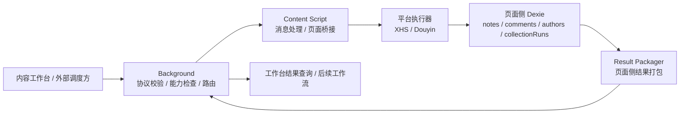

# 插件接入内容工作台统一验证状态报告

> 文档类型：插件侧统一状态报告  
> 更新日期：2026-04-10  
> 适用范围：`linggan-boom` 插件项目  
> 目的：把“已落地代码、已实机验证链路、当前架构判断、剩余风险与下一步顺序”统一收口成一份事实源

---

## 1. 一句话结论

截至 2026-04-10，插件作为“内容工作台的热插拔重执行端”这条技术路径已经被真实浏览器验证成立。

更准确地说，下面这条主链路已经在双平台上跑通：

内容工作台任务协议入口 -> Background 接单与路由 -> Content / 页面侧执行 -> 页面侧 Dexie 落库 -> Content 侧结果打包 -> Background 代理回传结果

这意味着当前阶段不需要推倒重来，重点已经从“证明这条路能不能走”转向“扩覆盖、补治理、收稳定性”。

---

## 2. 当前统一判断

### 2.1 架构判断

当前插件与内容工作台的关系应统一理解为：

1. 内容工作台是主系统
2. 插件是热插拔的重执行端
3. Background 是任务入口、协议校验与路由层
4. Content / 页面侧是真正的执行层和原始数据归属层
5. `collectionRuns` 是外部任务与本地执行记录的映射枢纽

### 2.2 当前阶段判断

当前项目状态不再是“纯方案设计阶段”，而是：

1. 协议边界已落地
2. 第一批远程任务已接入
3. 双平台第一批核心链路已完成真实页面验证
4. 剩余工作主要集中在长尾链路、心跳/监控、体积治理和文档持续防漂移

---

## 3. 已实机验证的链路

以下链路均已在真实浏览器页面中完成“派单成功 + 结果包返回成功”的验证。

| 任务类型 | 平台 | 状态 | 实机结论 |
|------|------|------|------|
| `xhs.collectAuthor` | 小红书 | 已验证 | `accepted: true`，`resultPackage.success: true` |
| `xhs.batchNotes` | 小红书 | 已验证 | `accepted: true`，`resultPackage.success: true` |
| `xhs.batchComments` | 小红书 | 已验证 | `accepted: true`，`resultPackage.success: true` |
| `douyin.batchNotes` | 抖音 | 已验证 | `accepted: true`，`resultPackage.success: true` |
| `douyin.batchComments` | 抖音 | 已验证 | `accepted: true`，`resultPackage.success: true` |
| `douyin.collectAuthor` | 抖音 | 已验证 | `accepted: true`，`resultPackage.success: true` |
| `douyin.singleComments` | 抖音 | 已验证 | `accepted: true`，`resultPackage.success: true` |
| `douyin.commentImageDownload` | 抖音 | 已验证 | `accepted: true`，任务可进入 `done` 并正确返回结果包；本次实测样本页无评论图片，返回空结果 |

2026-04-03 复测补记：

`xhs.batchNotes` 第一篇过早关闭问题已实机修复并复测通过，原因是目标笔记数据稳定判定过早；当前已改为连续稳定确认后再采集，不再出现“没采完整就关闭”的现象。

### 3.1 这 8 条验证说明了什么

它们共同证明了 3 件事：

1. 外部任务协议已经能稳定映射到插件内部动作
2. Background 与 Content 的职责边界已经基本画对
3. 结果包回传不再停留在“理论设计”，而是已经有真实数据闭环证据

---

## 4. 当前真实技术路径

### 4.1 这条链路为什么成立

因为插件当前真正有状态、能看到真实页面、能拿到平台数据的地方，不在 Popup，也不在 Background，而在页面里的 Content / 平台执行器。

所以正确分层必须是：

1. 外部系统把任务交给 Background
2. Background 先做能力检查和路由
3. 真正执行和落库发生在页面侧
4. 结果由页面侧打包，再由 Background 代理返回

---

## 5. 这轮实机验证暴露出的 5 个关键边界问题

这些问题都已经被定位并修复，它们说明“问题主要在边界实现，不在总体路线”。

### 5.1 Service Worker 不能带 Node 语义

问题：

`src/sync/flywheelSync.js` 顶层直接读取 `process.env.*`，导致 MV3 Background Service Worker 在浏览器环境启动异常。

结论：

Background 代码必须按浏览器环境约束编写，不能默认带 Node 全局对象。

### 5.2 关键运行时异步 chunk 在真实 content script 场景不稳定

问题：

1. 小红书侧暴露 `Loading chunk 845 failed`
2. 抖音侧暴露 `Loading chunk 309 failed`

结论：

当前阶段不能再把 `contentDataRuntime` 和 `douyinRuntime` 这类关键消息骨架继续建立在“异步 chunk 一定能稳定加载”的前提上。

### 5.3 `task.envelope` 与 `capability.check` 不能混用

问题：

`workbenchDispatchTask` 内部拿 `task.envelope` 直接去做 capability 校验，导致派单前自我拦截。

结论：

协议对象必须分型明确，映射层要显式承担转换职责。

### 5.4 远程任务“接单”与“执行完成”不能是同一个返回语义

问题：

远程 `xhs.collectAuthor` 初版会一直等采集执行完才返回，导致外部系统误以为派单能力失效。

结论：

远程任务必须拆成：

1. 接单确认
2. 异步执行
3. 结果查询 / 进度查询

### 5.5 Background 与页面侧不共享同一份数据域

问题：

Background 直接尝试从自己的 Dexie 视角打结果包，导致 `collectionRun not found`。

结论：

结果包必须尊重数据归属，优先从页面侧查询和打包，再由 Background 代理回传。

---

## 6. 当前已被验证正确的架构约束

后续开发时，以下约束应视为当前已被证实的“硬边界”。

1. Background 适合做任务入口、能力检查、协议校验、路由与结果代理
2. Content / 页面执行器适合做真实执行、状态推进、原始数据落库和结果打包
3. `collectionRuns` 不是可有可无的日志表，而是远程任务与本地执行记录的映射中枢
4. 关键运行时优先稳定，长尾依赖再考虑按需加载
5. 任何 bundle 优化都不能凌驾于真实页面消息链稳定性之上

---

## 7. 当前还没有完全验证的部分

虽然第一批核心链路已经通过，但还不能把整个插件判定为“工作台接入已全面完成”。

### 7.1 仍待重点验证

1. 内容工作台创建 `pending` 任务后，插件自动认领并将状态推进为 `dispatched / running / completed / failed` 的实机闭环
2. Dashboard / 数据面板对远程任务结果的二次消费体验
3. 停止 / 暂停 / 继续 在多任务、多页面下的统一语义

### 7.2 仍待产品化收口

1. 单实例插件自动认领模型已经代码落地，但尚未完成一轮“工作台创建任务 -> 插件自动接单 -> 工作台状态回写”的实机验收
2. 结果上传状态目前只走到 `pending_upload -> packaged`
3. 还没有真正的在线执行节点心跳与离线判定机制

### 7.3 已新增验证结论

截至 2026-04-03，`xhs.batchComments` 的长任务心跳已经完成真实页面验证：

1. `runRecord.lastHeartbeatAt` 会在任务运行中持续推进
2. 这说明 `collectionRun` 的 keepalive 机制已经不再停留在本地测试层
3. 当前剩余问题已从“心跳是否续写”转向“具体任务链路本身为何长时间维持 `running` 且结果未增长”
4. 进一步排查后确认：`xhs.batchComments` 在运行中已经能先把评论写入评论表，但 `collectionRuns` 的摘要字段此前只在任务结束时集中回写，导致实机观察中出现“`comments` 已增长而 `itemsSucceeded` 仍为 0”的错位；该问题已在 2026-04-03 修正为“每处理完一篇笔记就即时 patch 运行摘要”，待继续实机复测确认
5. `xhs.batchNotes` 第一篇过早关闭问题已在真实页面复测中确认修复：当前实现先做目标笔记数据连续稳定确认，再进入正式采集，避免在 note 数据尚未稳定时就提前关闭当前笔记
6. 2026-04-09 已完成 `douyin.singleComments` 的远程协议映射和 `douyin.commentImageDownload` 的远程 run 映射修复，并补齐了对应单测
7. `douyin.singleComments` 已在真实详情页完成“接单成功 + 评论落库 + 结果包回取成功”的实机验证
8. `douyin.commentImageDownload` 已在真实详情页完成“接单成功 + run 映射成功 + 结果包回取成功 + 空结果正常结束”的实机验证，说明当前链路已具备处理“该页没有评论图片”的正确语义
9. 2026-04-09 已完成“单实例插件自动认领内容工作台任务”第一版代码落地：内容工作台允许创建 `douyin.singleComments` 任务、任务详情支持 patch `pluginRunId / resultSummary / errorMessage`，插件侧新增 `taskPoller + chrome.alarms` 自动认领 `pending` 任务，并复用既有 `workbenchCapabilityCheck / workbenchDispatchTask / workbenchGetResultPackage` 推进状态
10. 上述自动认领链路当前仍缺一轮实机验收，尤其需要验证内容工作台任务列表中的 `pending -> dispatched / running -> completed / failed` 状态推进是否如设计所示

---

## 8. 当前主要风险

### 8.1 `content.js` 体积重新上升

为了换取真实页面稳定性，`contentDataRuntime` 与 `douyinRuntime` 已经回收到主包；随后长任务心跳统一、XHS 批量链路稳定确认又带来少量代码增长，当前 `content.js` 约 `357 KiB`，webpack 仍有 2 条体积 warning。

2026-04-10 构建复核：

1. `npm run build` 通过
2. 当前 `content.js` 已进一步上升到约 `361 KiB`
3. warning 仍维持在 2 条体积告警，说明这一风险仍真实存在，而不是历史数据残留

这不是当前必须立刻回滚的错误，但已经成为下一轮治理重点。

### 8.2 胖中心仍在转移

当前最大的复杂度中心已经不再是 `src/content/index.js`，而是：

1. `src/popup/popup.js`
2. `src/dashboard/dashboard.js`
3. `src/background/index.js`
4. `src/platforms/douyin/index.js`

### 8.3 长任务语义还没完全统一

虽然远程派单和结果包已经打通，但“停止 / 暂停 / 继续 / 阶段文案 / 错误包”在不同任务类型之间还没完全对齐。

---

## 9. 接下来的推荐顺序

### P0：继续补验证面

1. 真实验证“内容工作台创建任务 -> 插件自动认领 -> 工作台状态回写”闭环
2. 补 Dashboard / 数据面板对远程任务结果的二次消费体验验收
3. 明确 `commentImageDownload` 在“有评论图片区素材”的样本页上的非空结果表现

### P1：补治理

1. 为单实例自动认领模型补“background 重启后接管历史 `running` 任务”的恢复语义
2. 收口消息协议 envelope
3. 把 `background` 里的工作台网关再拆一层
4. 统一停止 / 暂停 / 继续 的跨任务语义

### P2：第二轮 bundle 治理

1. 不再优先拆关键运行时
2. 优先找真正安全的长尾依赖做异步化
3. 必须在每次体积治理后重新跑真实页面验证

---

## 10. 给后续接手开发的统一结论

如果后续有人只问一句“现在这套架构是不是对的”，当前统一答案是：

是对的，而且已经有真实浏览器证据支持。

但更准确的说法是：

1. 主路线已成立
2. 第一批核心远程任务已双平台验证通过
3. 当前最需要做的不是推翻，而是守住边界、继续补验证面、再做第二轮稳定性和体积治理

这份文档应作为 2026-04-02 这轮插件接入内容工作台工作的统一事实源。
