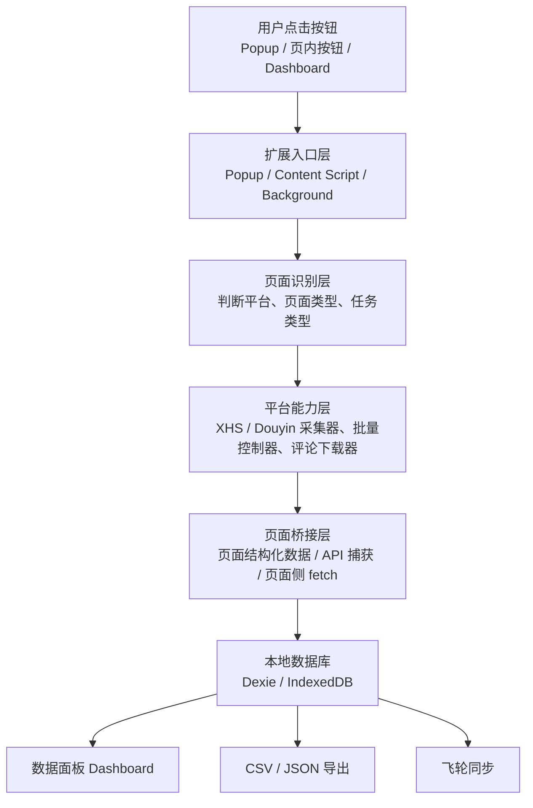
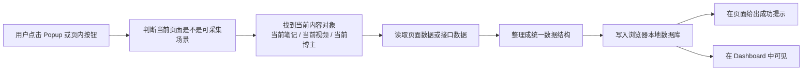
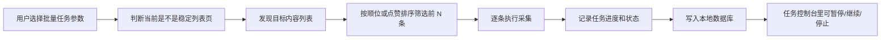

# 灵感爆爆爆 项目功能与架构地图（非技术版）

> 目的：给接手人和产品负责人一张“看得懂、能判断”的项目地图。  
> 这份文档不讨论实现细枝末节，重点回答三件事：
> 1. 这个项目现在到底能做什么  
> 2. 用户点一个按钮后，数据是怎么流动的  
> 3. 这套架构，是否适合继续往“多平台内容采集 + 本地数据管理 + AI 分析入口”这个方向走

---

## 1. 一句话看懂这个项目

**灵感爆爆爆** 现在本质上是一个“装在 Chrome 里的本地采集工作台”：

- 前台能在 **小红书 / 抖音** 页面上直接采内容、采评论、采博主、做批量任务
- 中台没有独立服务器，而是把数据先落在 **浏览器本地数据库**
- 后台再通过 **数据面板 / 导出 / 飞轮同步**，把这些数据继续拿去看、筛、导、分析

换句话说，它不是一个“网站后台系统”，而是一个“本地执行、网页内工作、浏览器里存数据”的采集型工具。

---

## 2. 现在已有的全部功能

### 2.1 你能直接看到的功能入口

项目现在有 4 个用户可见入口：

1. **Popup 弹窗**
   点浏览器扩展图标后打开，是总控台。

2. **页内浮动按钮**
   在小红书 / 抖音网页里直接出现，适合边看页面边操作。

3. **页内任务控制台**
   右下角长任务控制条，用来暂停、继续、停止。

4. **Dashboard 数据面板**
   打开后可以看已经采集到的数据、搜索、导出、删除、二次下载。

### 2.2 小红书当前能力

| 功能 | 现在状态 | 说明 |
|------|----------|------|
| 单篇笔记采集 | 稳定 | 进入笔记详情页，采标题、正文、作者、互动数据、媒体链接 |
| 单篇评论采集 | 稳定 | 支持评论上限和评论深度 |
| 博主采集 | 稳定 | 采主页资料、粉丝、互动数据 |
| 批量笔记采集 | 稳定 | 搜索页 / 博主页 / 收藏页均可跑 |
| 批量评论采集 | 稳定 | 按顺位或 Top N 跑批量评论 |
| 评论图片区下载 | 稳定 | 小红书这条链路已经完整 |
| 数据面板查看/导出 | 稳定 | 可在 Dashboard 中管理 |

### 2.3 抖音当前能力

| 功能 | 现在状态 | 说明 |
|------|----------|------|
| 单条视频采集 | 基本稳定 | 能识别当前视频，避免误采上一条 |
| 单条视频下载 | 基本稳定 | 下载走 Background，成功率较高 |
| 单条博主采集 | 基本稳定 | 博主页资料采集可用 |
| 单条评论采集 | 可用但仍需验收 | 底层链路通了，用户体验还需要回归 |
| 批量视频采集 | 基本稳定 | 博主页 / 搜索页都支持 |
| 批量评论采集 | 基本稳定 | 博主页 / 搜索页都支持 |
| 评论图片区下载 | 可用但仍需验收 | 高清字段链路已接通，但还在验证稳定性 |
| 数据面板二次下载 | 可用但仍需验收 | 支持重新刷新视频直链再下载 |

### 2.4 工具型功能

除了采集功能，项目还有 4 类工具功能：

1. **数据面板**
   看笔记、评论、博主三类数据。

2. **导出**
   支持 CSV 和 JSON。

3. **数据维护**
   用来补旧数据、清理结构不一致的问题。

4. **飞轮同步**
   把本地采集数据发到飞轮工作台，给 AI 选题评估使用。

---

## 3. 站在非技术视角，这个项目是怎么工作的

你可以把整个系统想成 6 层。

### 第 1 层：用户动作层

就是你真正点到的地方：

- Popup 里的按钮
- 页内浮动按钮
- 页内任务控制台
- Dashboard 里的导出 / 删除 / 再下载

### 第 2 层：扩展调度层

这是浏览器扩展自己的“指挥中心”：

- **Popup** 负责判断“当前页面能做什么”
- **Content Script** 负责跑在小红书 / 抖音页面里
- **Background** 负责下载、任务中转、角标状态、配置保存

你可以理解成：

- Popup 决定“发什么命令”
- Content Script 决定“去页面上怎么做”
- Background 决定“需要后台配合的事怎么做”

### 第 3 层：平台识别层

这层负责判断：

- 现在是小红书还是抖音
- 当前是详情页、博主页、搜索页，还是不稳定页面
- 当前页面到底适合做单条任务还是批量任务

这是最近重点修过的部分，因为如果这里判断错，用户就会看到错误按钮和错误提示。

### 第 4 层：平台采集层

真正干活的是这里：

- 小红书采集器
- 抖音采集器
- 评论采集器
- 批量任务控制器
- 博主采集器
- 评论图片区下载器

这是项目最核心的业务层。

### 第 5 层：页面桥接层

有些网页数据不是页面明摆着给你的，所以插件还做了一层“桥接”：

- 小红书优先读页面里的结构化状态
- 抖音优先用接口数据、页面桥接、API 捕获

这层决定的是“采集准不准、稳不稳、会不会采错对象”。

### 第 6 层：本地数据层

所有采集结果先存到浏览器本地：

- `notes`：内容主表
- `comments`：评论表
- `authors`：博主表
- `collectionRuns`：任务记录
- `mediaAssets`：媒体资产记录

这意味着它当前是一套 **本地优先** 架构，不依赖云端数据库才能工作。

---

## 4. 当前技术路径图

### 4.1 总路径图



### 4.2 你点一次“采集当前内容”时发生了什么



### 4.3 你点一次“批量任务”时发生了什么



---

## 5. 文件层级关系，翻译成人话是什么

下面这张表可以把“目录”翻译成“职能部门”。

| 目录 / 文件 | 非技术解释 | 当前作用 |
|-------------|------------|----------|
| `src/popup/*` | 扩展弹窗总控台 | 判断当前页可做什么，并发出任务 |
| `src/content/index.js` | 页面内总入口 | 把小红书和抖音页面真正接起来 |
| `src/content/contentDataRuntime.js` | 内容数据中枢 | 处理消息、给 Dashboard 提供数据桥 |
| `src/background/index.js` | 后台调度中心 | 负责下载、消息中转、任务状态和配置保存 |
| `src/dashboard/*` | 数据面板 | 让用户查看、筛选、导出、删除数据 |
| `src/platforms/xhs/*` | 小红书业务模块 | 放小红书所有采集逻辑 |
| `src/platforms/douyin/*` | 抖音业务模块 | 放抖音所有采集逻辑 |
| `src/injected/*` | 页面桥接模块 | 负责拿页面内部更深的数据 |
| `src/db/*` | 本地数据库模块 | 统一管理本地存储 |
| `src/shared/*` | 公共工具区 | 常量、消息、工具函数 |
| `src/sync/*` | 对外同步区 | 把本地数据发往飞轮等外部系统 |

---

## 6. 现在这套架构，适不适合你想要的方向

这个问题要先分成三种“你想要的架构”。

### 情况 A：你想要的是“一个能长期打磨的本地采集插件”

如果你的目标是：

- 先把小红书和抖音采集能力做扎实
- 以 Chrome 插件为主形态
- 先本地存数据，再接外部 AI 工作台
- 不想一上来就维护服务器、账号系统、云数据库

那我判断：**现在这套架构是对路的。**

原因是：

- 它已经完成了“用户入口层、采集层、数据层、导出层”的闭环
- 小红书和抖音已经不是硬写死在一坨代码里，而是开始按平台拆分
- 本地优先意味着开发和调试成本更低，也更适合快速验证产品价值

### 情况 B：你想要的是“未来能扩成多平台采集引擎”

如果你的目标是：

- 未来不只做小红书和抖音
- 后面还想接视频号、B 站、公众号等
- 希望每个平台都能像插模块一样接进来

那我判断：**现在方向是对的，但架构还没有完全长成。**

原因是：

- `platforms/xhs/*` 和 `platforms/douyin/*` 已经分出来了，这是好事
- 但真正的页面总入口 `src/content/index.js` 仍然偏重，还是“半平台化”
- Popup、Dashboard、DouyinAdapter 这些点又开始变胖，说明系统还在从“能跑”向“好扩展”过渡

简单说：

- **方向对**
- **抽象还不够彻底**
- **还没到“随便再接一个平台都很轻松”的程度**

### 情况 C：你想要的是“一个完整的云端内容中台”

如果你的目标是：

- 多人协作
- 远程统一数据库
- 云端任务调度
- 后台账号体系
- 任务历史、权限、团队视图、在线 AI 工作流

那我判断：**现在这套架构还不是那个形态。**

它现在更像：

- 一个强本地工具
- 一个浏览器里的采集工作台
- 一个为未来云端化预留了接口的前置阶段

不是一个真正意义上的 SaaS 后台系统。

---

## 7. 当前架构的优点和短板

### 7.1 当前优点

1. **本地闭环已经成立**
   采集、存储、查看、导出、再下载，已经能形成完整工作流。

2. **多平台方向已经起势**
   小红书和抖音不再共用一套混乱逻辑，已经开始按平台拆分。

3. **批量任务模型已经存在**
   说明项目不只是“点一下采一条”，而是开始具备工作流能力。

4. **本地数据模型已经够用**
   `notes / comments / authors / collectionRuns / mediaAssets` 这五张表，足够支撑下一阶段优化。

5. **后续 AI 分析入口已经预留**
   飞轮同步已经接上，不需要重新发明一条数据出口。

### 7.2 当前短板

1. **页面入口还不够轻**
   `src/content/index.js` 仍然承担了过多协调工作。

2. **管理端逐渐变胖**
   `popup.js`、`dashboard.js`、`src/platforms/douyin/index.js` 都已经在变成新的中心文件。

3. **验收闭环还不够硬**
   代码里有功能，不等于真实页面上已经稳定验收。

4. **当前还是单机能力，不是团队能力**
   这会影响后面如果你要做多人协作、共享数据、统一任务中心。

---

## 8. 我给你的直接判断

如果你现在想做的是：

- 先把“小红书 + 抖音内容采集工作台”打磨到好用
- 把它变成一个稳定的个人/小团队内容研究工具
- 再逐步接 AI 选题、分析和工作流

那我的判断是：

**这套架构可以继续投，不需要推倒重来。**

但它现在最适合的路径不是“立刻大重构”，而是：

1. 继续把现有功能验收扎实
2. 继续把胖文件拆薄
3. 继续把“平台判断”和“任务状态”做统一
4. 在确认产品价值后，再决定要不要走云端化

---

## 9. 给你一个最实用的判断标准

你不需要用“代码漂不漂亮”来判断它是不是你要的架构。

你只需要看 4 个问题：

1. **新平台好不好接**
   未来接第三个平台，是不是只要新增一个平台模块，而不是重写全局。

2. **任务状态清不清楚**
   用户能不能知道自己正在做什么、卡在哪、是否可继续。

3. **数据是不是统一**
   小红书和抖音采回来的数据，能不能进同一套面板、导出和分析链路。

4. **后面能不能长成你想要的产品**
   是只做本地工具，还是未来要长成云端内容中台。

从现在看：

- 前 3 个问题，项目已经有基础
- 第 4 个问题，当前还在“本地工作台”阶段，还没进入“云端中台”阶段

---

## 10. 我建议你下一步怎么用这份图

你可以拿这份图，直接问自己三句话：

1. 我现在要的是“本地采集工具”，还是“云端团队系统”？
2. 我接下来三周最重要的是“补功能”，还是“做结构治理”？
3. 我希望这个项目半年后是什么形态？

如果你愿意，我下一步可以继续直接帮你补第二份文档：

- **版本 A：产品负责人视角**
  只讲用户功能、成熟度、风险和优先级

- **版本 B：接手开发视角**
  讲模块责任、文件关系、下一步改造顺序和风险点

---

## 11. 如果未来主系统是“内容工作台”

本轮进一步确认后，这份图还需要多加一层解释：

- **内容工作台** 是未来主系统
- **灵感爆爆爆插件** 是热插拔的重执行端

这会改变我们看插件架构的方式。

### 11.1 插件继续保留什么

插件未来仍应保留：

1. 网页内采集体验
2. 单条采集
3. 批量采集
4. 博主采集
5. 评论采集
6. 评论图片区下载
7. 页内暂停 / 继续 / 停止
8. 页面桥接、API 捕获、媒体下载等强执行能力

### 11.2 插件不再承担什么

插件未来不应继续长成下面这些东西：

1. 多人协作主界面
2. 统一任务中心
3. 账号体系
4. 团队视图
5. 权限系统
6. 在线 AI 工作流主编排

### 11.3 正确的主从关系

未来更准确的关系是：

```text
内容工作台（主系统）
  → 在线执行节点
    → 插件（重执行端）
      → 小红书 / 抖音真实页面
```

所以，插件不是要被削成“轻上传器”，而是继续做强执行工具；  
但它也不应该再被当成未来系统的主后台。
