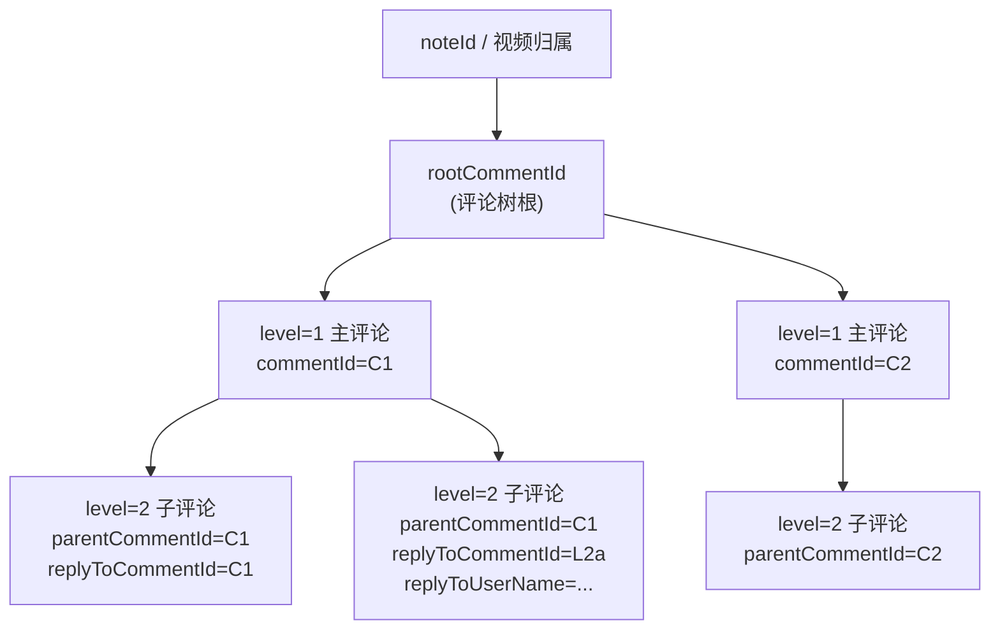
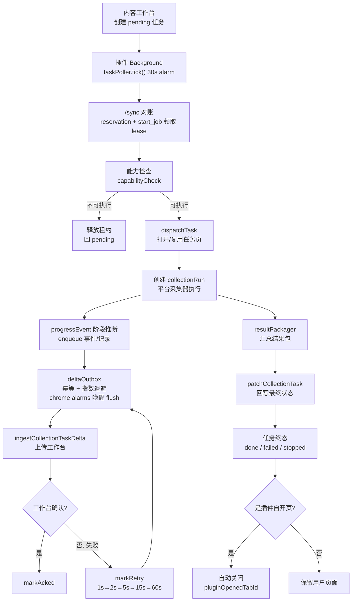
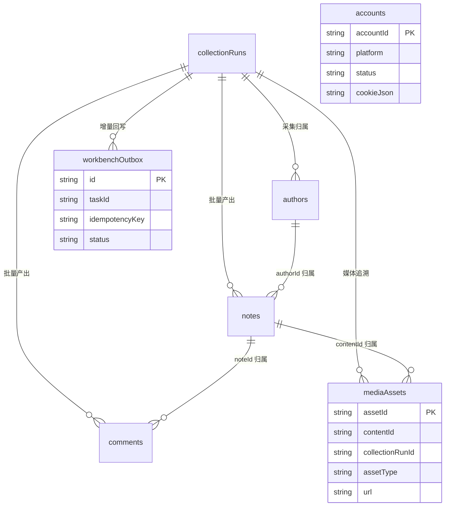
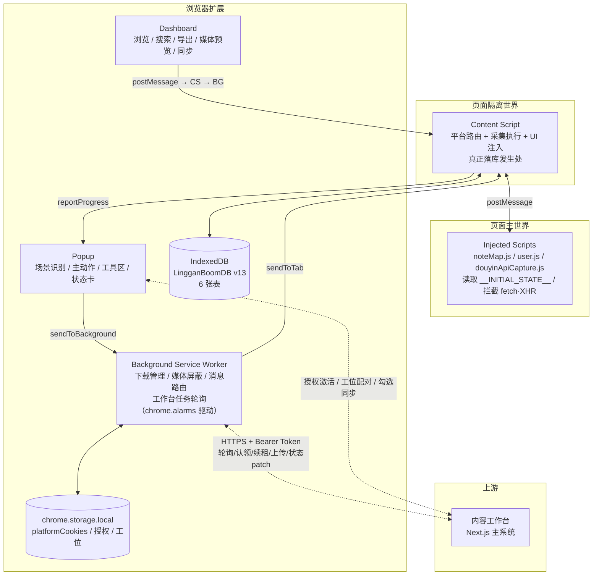
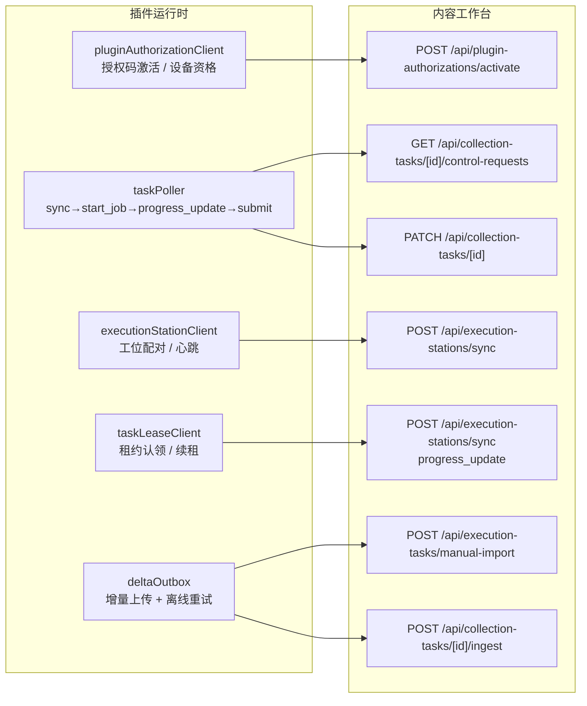
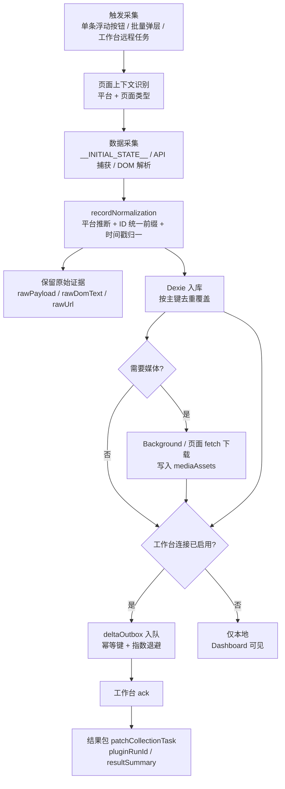

# 灵感爆爆爆 — 统一产品 PRD（插件执行端视角）

> 关联文档：[APP_FLOW.md](APP_FLOW.md) · [TEST_CHECKLIST.md](TEST_CHECKLIST.md) · [../SELECTORS.md](../SELECTORS.md) · [../ARCHITECTURE.md](../ARCHITECTURE.md) · [../technical/DATA_MODEL.md](../technical/DATA_MODEL.md)
>
> **文档分层说明**：本 PRD 第 2 节"功能规格库"是 agent 实现时的权威 spec（每项功能含入口/前置/输入/数据源/字段/规则/异常/验收）。第 5–6 节是数据模型与架构的概览，完整字段见 [DATA_MODEL.md](../technical/DATA_MODEL.md)，完整消息见 [MESSAGE_PROTOCOL.md](../technical/MESSAGE_PROTOCOL.md)。

## 1. 产品概述

**灵感爆爆爆** 在统一产品里不是一个独立产品，而是"内容工作台"体系中的浏览器执行端。

统一产品的固定分工是：

- 内容工作台：主系统，负责任务入口、Topic 承载、洞察查看、人工评估、推进与复盘沉淀
- 灵感爆爆爆插件：执行端，负责真实网页里的采集、评论展开、媒体捕获、页面上下文识别与结果回传

因此，本 PRD 采用"插件执行端视角"描述产品，不把插件误写成完整主系统。

在这个前提下，**灵感爆爆爆** 仍然是一款 Chrome 扩展插件（Manifest V3，当前版本 2.0.87），帮助用户在小红书与抖音上高效采集内容数据，并提供本地存储、搜索、导出、媒体下载等数据管理能力；同时它还要承担和内容工作台之间的任务桥接、结果同步与远程执行职责。

### 1.1 核心价值

- 作为统一产品的网页内执行端，承接内容工作台下发的真实采集任务
- 作为团队内受控执行端，只有被内容工作台授权的成员 / 设备才可使用插件能力
- 一键采集内容主体信息与互动指标
- 批量采集博主页/搜索页内容，并支持按点赞排序
- 采集评论及子评论，保留后续分析所需的层级关系
- 下载内容媒体与评论图片区高清资源
- 在本地 Dashboard 中完成查看、筛选、导出与二次下载
- 将选中的内容、采集任务状态与结果摘要同步回内容工作台
- 在启用工作台连接后自动轮询可执行的待办采集任务，并将 `pluginRunId / resultSummary / errorMessage` 回写给工作台

### 1.2 产品边界

插件负责：网页内采集动作、页面交互与上下文识别、批量任务执行、原始结果与本地缓存与结果包输出、向内容工作台回传进度状态与可导入结果。

插件不负责：`Topic` 生命周期管理、洞察结果的主承载、人工评估与采纳决策、复盘沉淀与团队知识管理。这些能力统一归属于内容工作台主系统。

### 1.3 功能索引表（2026-06-25）

> 下表是功能清册与状态总览。**每个功能的完整规格在第 2 节**，按 `#锚点` 跳转。
>
> **状态图例**：✅ 已完成 = 主链路稳定，有回归覆盖；🟡 部分完成 = 底层链路可用，仍有产品化或长时效验收项。

#### 小红书

| ID | 功能 | 状态 | 规格锚点 |
|----|------|------|----------|
| X1 | 单篇内容采集 | ✅ 已完成 | [#x1-小红书单篇内容采集](#x1-小红书单篇内容采集) |
| X2 | 批量内容采集 | ✅ 已完成 | [#x2-小红书批量内容采集](#x2-小红书批量内容采集) |
| X3 | 单篇评论采集 | ✅ 已完成 | [#x3-小红书单篇评论采集](#x3-小红书单篇评论采集) |
| X4 | 批量评论采集 | ✅ 已完成 | [#x4-小红书批量评论采集](#x4-小红书批量评论采集) |
| X5 | 博主采集 | ✅ 已完成 | [#x5-小红书博主采集](#x5-小红书博主采集) |
| X6 | 评论图片区下载 | ✅ 已完成 | [#x6-小红书评论图片区下载](#x6-小红书评论图片区下载) |

#### 抖音

| ID | 功能 | 状态 | 规格锚点 |
|----|------|------|----------|
| D1 | 单条视频采集 | ✅ 已完成 | [#d1-抖音单条视频采集](#d1-抖音单条视频采集) |
| D2 | 单条视频下载 | ✅ 已完成 | [#d2-抖音单条视频下载](#d2-抖音单条视频下载) |
| D3 | 单条博主采集 | ✅ 已完成 | [#d3-抖音单条博主采集](#d3-抖音单条博主采集) |
| D4 | 单条评论采集 | 🟡 部分完成 | [#d4-抖音单条评论采集](#d4-抖音单条评论采集) |
| D5 | 批量视频采集 | ✅ 已完成 | [#d5-抖音批量视频采集](#d5-抖音批量视频采集) |
| D6 | 批量评论采集 | ✅ 已完成 | [#d6-抖音批量评论采集](#d6-抖音批量评论采集) |
| D7 | 评论图片区下载 | 🟡 部分完成 | [#d7-抖音评论图片区下载](#d7-抖音评论图片区下载) |
| D8 | 数据面板二次下载 | 🟡 部分完成 | [#d8-抖音数据面板二次下载](#d8-抖音数据面板二次下载) |

#### 内容工作台协同

| ID | 功能 | 状态 | 规格锚点 |
|----|------|------|----------|
| W1 | Dashboard 勾选同步 | ✅ 已完成 | [#w1-dashboard-勾选同步](#w1-dashboard-勾选同步) |
| W2 | 自动接单与状态回写 | 🟡 部分完成 | [#w2-自动接单与状态回写](#w2-自动接单与状态回写) |
| W3 | detail_probe 目标解析 | ✅ 已完成 | [#w3-detail_probe-目标解析](#w3-detail_probe-目标解析) |

---

## 2. 功能规格库

> 每个功能按统一模板展开。模板字段含义：
> - **入口**：触发位置与按钮文案
> - **前置条件**：执行前必须满足的页面/授权/工位条件
> - **输入参数**：用户可配置项 + 默认值 + 取值范围
> - **数据源**：技术路径（API / DOM / 全局变量 / 注入脚本）
> - **写入字段**：落库目标表 + 关键字段
> - **业务规则**：前置约束、不变量、去重、排序
> - **反检测**：适用的节流参数（详见第 5 节）
> - **状态机**：任务生命周期与控制操作
> - **异常处理**：失败点 + 错误归类 + 恢复策略
> - **验收点**：可观察的成功/失败标志

### 2.0 交互入口（容器型能力）

#### Popup 总控入口

- **职责**：识别当前平台与页面场景；告诉用户当前页能做什么、不能做什么；区分单条/批量/工具动作；在同一张任务状态卡中展示进度、阶段和批量控制；与页内任务控制台共享阶段语义
- **头部布局**：紧凑双列。左侧品牌区垂直居中放置原尺寸长条品牌 banner；右侧上方平台/主题切换，下方显示较小的"灵感爆爆爆"；不显示方形 logo 与工具箱副标题
- **信息分区顺序**：当前页面 → 当前内容动作 → 批量任务动作 → 数据面板/导出/数据维护
- **交互硬规则**：
  - 主动作按钮、工具按钮、弹层确认按钮都必须支持忙碌态：点击后立即禁用重复触发，显示旋转指示或"执行中 / 获取中 / 导出中"
  - 危险动作必须显式确认：停止批量任务、删除账号、删除单条数据、批量删除、清空数据前，都要给出风险说明和确认按钮
  - 批量设置弹层必须提供智能默认值：根据平台、页面类型、最近一次选择和任务类型自动预填
- **目标**：新用户首次打开 Popup 时，能在 5 秒内理解当前页可执行的操作

#### 页内任务控制台

- **职责**：长任务运行时在页面右下角提供暂停/继续/停止控制 + 顶部通知条
- **统一原则**：统一的是结构与阶段语义，不是平台文案。抖音任务必须显示抖音语义（"抖音任务控制台"），不回退小红书标题/按钮
- **阶段徽章**：准备中 / 扫描中 / 下载中 / 暂停中（与进度阶段 `progressEvent` 对齐）
- **状态保留**：暂停态保留进度摘要；停止/完成态短暂保留结果汇总

#### Dashboard 数据面板

- **入口**：Popup → "打开 Dashboard" 或页内浮动入口
- **头部**：顶部左侧仅保留长条 `LG BOOM banner`；不显示方形 logo 或额外标题行
- **三个 tab**：笔记 / 评论 / 博主（对应 `notes / comments / authors` 三表）
- **能力清单**：表格展示、搜索、筛选、按采集时间排序、单条删除、全量清空、CSV/JSON 导出、媒体预览、勾选 + 批量导出/删除/同步、媒体二次下载
- **空状态三分类**：正在加载 / 库里还没有数据 / 当前筛选条件下无结果（不能只写"暂无数据"）
- **状态色语义**：成功/已完成=绿，处理中/提示=蓝，待处理/需注意=黄，失败/风险=红，中性=灰
- **通知一致性**：Dashboard 顶部通知条与页内 Toast / Popup Notice 共享同一套标题、正文、图标和色彩语义

#### Cookie & 账号管理

- **入口**：Popup "数据"标签页 → "Cookie & 账号"区块 → "获取当前平台 Cookie"
- **抓取范围**：只抓当前页面所在平台（小红书页只抓小红书，抖音页只抓抖音）
- **抓取策略**：cookies API → domain 查询 → content script `document.cookie`（三级兜底）
- **存储**：`chrome.storage.local` 的 `platformCookies`（运行时 HTTP 拼接用）+ `accounts` 表（账号管理 + 配额追踪用）
- **账号自动入库**：小红书 Cookie 成功抓取后自动保存为 `accounts` 记录；抖音页抓取不误新增小红书账号
- **账号操作**：列表展示、删除（二次确认）、手动添加（弹窗粘贴 Cookie，一键提取失败时直接提示"先登录小红书"）
- **多账号轮换**：采集时按账号状态/配额/冷却选择可用账号（详见 [2.0 账号字段](#54-表字段明细)）

---

### <a id="x1-小红书单篇内容采集"></a>X1 — 小红书单篇内容采集

| 项 | 规格 |
|----|------|
| **状态** | ✅ 已完成（当前稳定能力） |
| **入口** | 笔记详情页浮动按钮"采集笔记"（由 `content/uiInjector.js` 注入） |
| **前置条件** | `PAGE_TYPE = NOTE_DETAIL`；平台检测为 xhs；插件已授权 |
| **触发消息** | `MSG.COLLECT_SINGLE_NOTE` |
| **数据源** | 优先安全解析详情页 SSR 内嵌脚本中的 `noteDetailMap[noteId]`；兼容仍保留 `window.__INITIAL_STATE__` 的页面，并用 `injected/noteMap.js` 读取。禁止执行页面脚本文本 |
| **写入表** | `notes`（主键 `noteId` 去重覆盖） |
| **关键字段** | `noteId`、`contentId`(=`xhs_{noteId}`)、`platform=xhs`、`title/content/type`(normal·video)、`cover/images[]/video`、`likes/collects/comments/shares`、`keywords[]/topicIds[]/atUserList[]`、`authorId/authorName/authorAvatar`、`ipLocation/lastUpdateTime/shareRestricted/authorFollowed`、`rawPayload/rawDomText/rawUrl`、`dataSource`(dom·render·api)、`triggerSource=manual`、`collectorVersion` |
| **媒体下载** | 采集完成后弹窗询问是否下载；可选项：`cover`(封面，count=1)、`images`(所有图片)、`livePhoto`(Live 图)、`video`(视频，仅 video 类型笔记)。逐个走 Background `DOWNLOAD_MEDIA_FILE`；高清候选走 `getHighQualityImageCandidates` |
| **业务规则** | 同一 `noteId` 覆盖更新；`contentId` 统一前缀 `xhs_`；原始证据字段（`raw*`）保留截断序列化 |
| **状态** | 单条无 `collectionRun`；落库后发 `MSG.COLLECT_DONE` |
| **异常处理** | 全局 `__INITIAL_STATE__` 被页面水合清理时读取 SSR 内嵌 `noteDetailMap`；两路结构化事实均缺失才返回 `CONTEXT` 错误；媒体下载失败 → `DOWNLOAD` 错误；视频旧直链失效 → 刷新媒体链接后重试 |
| **验收点** | Dashboard `notes` tab 出现新记录；标题/作者/互动数与页面一致；勾选下载媒体后文件落盘 |

### <a id="x2-小红书批量内容采集"></a>X2 — 小红书批量内容采集

| 项 | 规格 |
|----|------|
| **状态** | ✅ 已完成 |
| **入口** | 搜索页 / 博主页 / 发现页 → Popup "批量采集笔记" 或页内入口 |
| **前置条件** | `PAGE_TYPE ∈ {SEARCH, PROFILE, EXPLORE}`；插件已授权 |
| **触发消息** | `MSG.START_BATCH_NOTES` |
| **采集模式** | `COLLECT_MODE`：`search` / `profile` / `favorite`；工作台 `detail_probe` 走 `detail` 模式（见 W3） |
| **输入参数** | 数量 `[5, 10, 20, 50]`（硬上限 `maxPerSession = 50`）；搜索页原生筛选：排序依据 / 笔记类型 / 发布时间；博主页可选"按点赞排序取 Top N" |
| **数据源** | DOM 卡片发现（`pageDetector` + 滚动加载）→ 逐条打开详情 → SSR 内嵌 `noteDetailMap` 优先、主世界 `__INITIAL_STATE__` 兼容 |
| **反检测参数** | 笔记间停顿 `intervalMin~Max = 1200~2800ms`；滚动步长 `scrollStepMin~Max = 100~300px`；滚动间隔 `scrollIntervalMin~Max = 200~500ms`；详情页加载超时 `iframeTimeout = 15000ms`；最大滚动重试 `maxScrollRetries = 10` |
| **写入表** | `notes`（每条立即落库）；`collectionRuns`（创建 run，`processedCount / nextIndex / resumeCheckpoint` 持续更新） |
| **业务规则** | **D23**：搜索页选择筛选后，必须先确认选中状态，再等待笔记流刷新并连续稳定，之后才能扫描和采集，避免网络慢时采到旧列表；**D19**：`author_baseline` 首次建档固定为"先采博主，再按当前博主页顺位补前 50 篇"，不走点赞 Top N；作品记录尽量带封面，详情页缺图时用博主页卡片封面兜底 |
| **状态机** | `idle → running ⇄ paused → stopping → done / stopped / failed`（断点续跑：`resumeCheckpoint = {targetIds, nextIndex, processedCount}`，恢复时跳过已完成目标） |
| **控制操作** | Popup 与页内控制台共享 `PAUSE / RESUME / STOP`（STOP 前二次确认） |
| **异常处理** | 单条详情加载超时 → 跳过该条并记 error，不中断整批；验证码触发 → `watchCaptcha` 自动暂停任务等待人工处理 |
| **验收点** | run 终态 `done`；`processedCount` 达到目标数；Dashboard 出现 N 条新笔记且带封面 |

### <a id="x3-小红书单篇评论采集"></a>X3 — 小红书单篇评论采集

| 项 | 规格 |
|----|------|
| **状态** | ✅ 已完成 |
| **入口** | 笔记详情页浮动按钮"采集评论" → 设置弹层 |
| **前置条件** | `PAGE_TYPE = NOTE_DETAIL`；插件已授权 |
| **触发消息** | `MSG.COLLECT_SINGLE_COMMENT` |
| **输入参数** | 评论数量上限（留空或 0 = 不限）；采集深度 `COMMENT_DEPTH_MODE`：`twoLevel`(两级) / `allReplies`(尽量全部回复) |
| **数据源** | 评论 API 捕获优先（`comment/page` + `sub/page`）+ 主动分页补拉 + 自动滚动/子评论展开触发加载；API 未命中则回退 DOM 解析 |
| **反检测参数** | 主评论间停顿 `200~500ms`；滚动等待 `800~1500ms`；子评论展开间隔 `1.2~2.2s`；`maxSubComments = 200`；最大展开次数 `20` |
| **写入表** | `comments`（按 `commentId + noteId + platform` 去重更新）；`commentEntityId = xhs_{noteId}_{commentId}` |
| **层级字段** | `parentCommentId`(父评论)、`rootCommentId`(树根)、`level`(1=主/2=子)、`replyToCommentId`(直接回复对象)、`replyToUserName` |
| **业务规则** | 评论必须能明确归属到对应笔记；层级关系完整保留（见下方评论树图） |
| **状态** | 创建单条评论 `collectionRun` |
| **异常处理** | 评论区不存在 → `CONTEXT`；API 失败自动回退 DOM；验证码 → 自动暂停 |
| **验收点** | `comments` tab 出现该 `noteId` 的评论树；父子层级可还原 |

**评论树层级关系**（适用于 X3 / X4 / D4 / D6）：



### <a id="x4-小红书批量评论采集"></a>X4 — 小红书批量评论采集

| 项 | 规格 |
|----|------|
| **状态** | ✅ 已完成 |
| **入口** | 搜索页 / 博主页 → "批量采集评论" |
| **前置条件** | `PAGE_TYPE ∈ {SEARCH, PROFILE}`；插件已授权 |
| **触发消息** | `MSG.START_BATCH_COMMENTS` |
| **输入参数** | 篇数 `[5, 10, 20, 50]`；每篇评论上限（留空=不限）；采集深度 `twoLevel / allReplies`；弹层根据平台/页面/历史偏好智能预填 |
| **执行流程** | 应用筛选并等待列表稳定（D23）→ 扫描页面 → 逐篇打开笔记 → 调用单篇评论采集链路（X3）→ 串行可控 |
| **反检测参数** | 同 X3；篇间额外走 `BATCH_CONFIG` 节流 |
| **写入表** | `comments`（每条带 `collectionRunId` 归属到本批 run） |
| **状态机** | 同 X2（批量任务生命周期） |
| **控制操作** | `PAUSE / RESUME / STOP`（STOP 二次确认） |
| **异常处理** | 单篇失败不阻断后续篇；验证码自动暂停 |
| **验收点** | run 终态 `done`；每篇评论都能归属到对应笔记并保留层级 |

### <a id="x5-小红书博主采集"></a>X5 — 小红书博主采集

| 项 | 规格 |
|----|------|
| **状态** | ✅ 已完成 |
| **入口** | 博主页 Popup "采集当前博主" 或页内浮动按钮 |
| **前置条件** | `PAGE_TYPE = PROFILE`；平台 xhs；插件已授权 |
| **触发消息** | `MSG.COLLECT_AUTHOR` |
| **数据源** | `injected/user.js` 注入主世界读 `window.__INITIAL_STATE__.user.userPageData` + DOM 补充 |
| **写入表** | `authors`（主键 `userId` 去重覆盖）；`authorEntityId = xhs_{userId}`；`handle = redId` |
| **关键字段** | `userId`、`name`、`avatar`、`description`、`profileUrl`、`redId`、`keywords[]`、`follows`、`fans`、`interactions`、`ipLocation`、`gender`、`accountStatus`、`followedByMe`、`rawPayload`、`rawSource`(`profile-api` / `userPageData+dom`) |
| **业务规则** | 同一 `userId` 覆盖更新；`handle` 是跨平台统一展示字段（小红书侧等于 `redId`） |
| **异常处理** | 当前页不是有效博主页 → `CONTEXT` 错误并提示可读原因 |
| **验收点** | `authors` tab 出现该博主；名称/小红书号/粉丝/关注/互动数可见 |

### <a id="x6-小红书评论图片区下载"></a>X6 — 小红书评论图片区下载

| 项 | 规格 |
|----|------|
| **状态** | ✅ 已完成 |
| **入口** | 笔记详情页 → "评论图片下载" |
| **前置条件** | `PAGE_TYPE = NOTE_DETAIL`；插件已授权 |
| **执行流程** | 自动滚动评论区收集图片 URL → 排除头像和表情 → 逐个下载（或 ZIP 打包，`JSZip` 按需动态加载） |
| **写入表** | `mediaAssets`（`assetType=comment_image`、`role=cover/body`、`candidateUrls[]`、`url`） |
| **业务规则** | 图片 URL 去重；扫描"已发现 X 张"与下载队列"X/Y"必须同一去重口径，不能自相矛盾 |
| **异常处理** | 评论无图 → 明确提示"未发现可下载图片"，不误下头像/表情 |
| **验收点** | 图片落盘；`mediaAssets` 有对应记录；不含头像/表情/装饰图 |

---

### <a id="d1-抖音单条视频采集"></a>D1 — 抖音单条视频采集

| 项 | 规格 |
|----|------|
| **状态** | ✅ 已完成 |
| **入口** | 视频弹层页点击"采集当前视频"；**或**点击抖音原生"分享"按钮，插件识别为"当前视频确认"（D7） |
| **前置条件** | `PAGE_TYPE = VIDEO_DETAIL`；先确认 `VideoContext`（主页预览态 / 博主页弹层态 / 直接视频页）；插件已授权 |
| **触发消息** | 分享动作或采集按钮 → 内部统一为当前视频确认 |
| **数据源** | 三源融合（`videoCollector.js`）：API 拦截（`injected/douyinApiCapture.js` → `window.__lgboom_dy_video_data`）+ render data + DOM；必要时 detail API 补全 |
| **VideoContext 原则** | 弹层态下当前视频由 `modal_id + active video + visible video-info` 共同确认；`vid` 只做兜底，不允许覆盖当前激活视频；采集/下载/评论/数据面板消费同一份 `VideoContext` |
| **写入表** | `notes`（主键 `noteId = dy_{awemeId}`，`platform = douyin`） |
| **关键字段** | `noteId(dy_)`、`platformContentId(awemeId)`、`url/title/content`、`hashtags[]`、`cover`、`authorId/authorName/handle`、`videoPlayUrl/videoDownloadUrl`、`shareText/shareShortUrl`、`triggerSource`(native_share / manual)、`dataSource`、`rawPayload` |
| **业务规则** | URL / DOM / API 返回会错峰更新，必须以 VideoContext 为准；不允许默默采到上一条视频 |
| **异常处理** | 当前视频无法确认 → `CONTEXT` 错误并提示可读原因，不静默采错 |
| **验收点** | Dashboard `notes` tab 新增当前视频记录；标题/链接/视频 ID 与当前视频一致 |

### <a id="d2-抖音单条视频下载"></a>D2 — 抖音单条视频下载

| 项 | 规格 |
|----|------|
| **状态** | ✅ 已完成 |
| **入口** | 当前视频 → "下载视频" |
| **前置条件** | VideoContext 已确认；插件已授权 |
| **技术路径** | **D18**：页面上下文 `fetch`（绕过 CDN 鉴权），不再用 `chrome.downloads.download`；移除 open-ended Range |
| **触发消息** | Background `DOWNLOAD_MEDIA_FILE` / `FETCH_BINARY_AS_DATA_URL`（兜底） |
| **业务规则** | 优先用当前视频对应直链；旧直链失效时基于 `platformContentId` 刷新 detail API 后再下载 |
| **异常处理** | 直链失效 → 自动刷新重试；fetch 受限 → `dataUrl` 回退；仍失败 → `DOWNLOAD` 错误 |
| **验收点** | 视频文件下载成功且可播放；内容对应当前视频而非上一条 |

### <a id="d3-抖音单条博主采集"></a>D3 — 抖音单条博主采集

| 项 | 规格 |
|----|------|
| **状态** | ✅ 已完成 |
| **入口** | 抖音博主页 → "采集当前博主" |
| **前置条件** | `PAGE_TYPE = PROFILE`；平台 douyin；插件已授权 |
| **触发消息** | `MSG.COLLECT_AUTHOR` |
| **数据源** | `authorCollector.js`：render data + API + DOM 多源采集（防串号，见 probe-douyin-author-fields） |
| **写入表** | `authors`（主键 `userId` 去重覆盖）；`authorEntityId = dy_{userId}`；`handle = 抖音号` |
| **关键字段** | `userId`、`authorEntityId(dy_)`、`platform=douyin`、`handle`、`secUserId`、`name`、`avatar`、`description`、`profileUrl`、`follows`、`fans`、`interactions`、`gender`、`accountStatus`、`followedByMe` |
| **业务规则** | `secUserId` 与 `userId` 不可混淆；多源数据需校验归属一致，防止串号 |
| **异常处理** | 主页信息读取失败 → `CONTEXT` 错误 |
| **验收点** | `authors` tab 出现该博主；抖音号/粉丝/关注/互动数可见且归属正确 |

### <a id="d4-抖音单条评论采集"></a>D4 — 抖音单条评论采集

| 项 | 规格 |
|----|------|
| **状态** | 🟡 部分完成（底层链路可用，仍需完整产品化验收） |
| **入口** | 视频弹层页 → "采集当前评论" |
| **前置条件** | VideoContext 已确认；插件已授权 |
| **输入参数** | 评论上限（留空或 0 = 尽量采全量）；采集深度 `twoLevel / allReplies` |
| **数据源** | 评论接口 + 回复接口；必要时页面桥接补足页面态请求上下文 |
| **写入表** | `comments`（`commentEntityId = dy_{contentId}_{commentId}`）；层级字段同 X3 |
| **业务规则** | 包含一级和二级评论；评论必须能明确归属到对应视频；已修复"留空=全量"时的假满进度 |
| **状态** | 创建单条评论 `collectionRun`；已补 `stopped + partial result` 自动回归 |
| **异常处理** | 视频无法确认 → `CONTEXT`，不误采到别的视频；评论接口失败 → 页面桥接兜底 |
| **验收点** | `comments` 表能明确看到这条视频的评论树；不误采到别的视频 |
| **待验收** | 真实账号下的完整产品化体验 |

### <a id="d5-抖音批量视频采集"></a>D5 — 抖音批量视频采集

| 项 | 规格 |
|----|------|
| **状态** | ✅ 已完成 |
| **入口** | 博主页 / 搜索页 → Popup 或页内入口 → "批量视频" |
| **前置条件** | `PAGE_TYPE ∈ {SEARCH, PROFILE}`；插件已授权 |
| **触发消息** | `MSG.START_BATCH_NOTES`（douyin 适配器） |
| **输入参数** | 数量 `[5, 10, 20, 50]`；可选"按点赞排序取 Top N" |
| **数据源** | **D8**：作品列表 API 驱动（不依赖用户手动滑动）；搜索页优先用页面捕获的 `aweme` 数据补全媒体与话题字段；API 作为补全与兜底，不覆盖页面当前顺位 |
| **执行流程** | 若启用 Top N，先尽量扫描足够多作品后再排序 → 按选定顺序逐条落库 |
| **写入表** | `notes`（每条 `dy_` 前缀）；搜索页批量额外写入 `searchKeyword / searchPageUrl` |
| **业务规则** | 不依赖手动滑动；批量采到的视频必须进入数据面板且恢复媒体预览与 `hashtags` |
| **反检测参数** | 分级节流（采集量越大间隔越保守） |
| **异常处理** | 单条失败不阻断；列表 API 失败 → 页面桥接兜底 |
| **验收点** | run 终态 `done`；Dashboard 出现 N 条抖音视频，带媒体预览和 hashtags；后续可再次下载 |

### <a id="d6-抖音批量评论采集"></a>D6 — 抖音批量评论采集

| 项 | 规格 |
|----|------|
| **状态** | ✅ 已完成 |
| **入口** | 抖音博主页 / 搜索页 → "批量评论" |
| **前置条件** | `PAGE_TYPE ∈ {SEARCH, PROFILE}`；插件已授权 |
| **输入参数** | 视频数 `[5, 10, 20]`；选取方式（当前页面顺位前 N 条 / 点赞 Top N）；每条视频评论上限（留空=尽量全量，默认 20）；采集深度 `twoLevel / allReplies` |
| **数据源** | **D9**：作品列表 + 评论/回复接口 + 页面桥接兜底 |
| **执行流程** | 获取作品列表 → 若 Top N 先扫描足够作品再排序 → 逐条拉评论接口和回复接口 |
| **写入表** | `comments`（每条归属到对应视频，带层级）；搜索页批量评论与对应视频都带 `searchKeyword` |
| **业务规则** | 每条评论必须能归属到对应视频；某条视频失败不阻断后续 |
| **状态机** | 同 X2；运行中右下角必须显示"抖音任务控制台"（不回退小红书文案） |
| **异常处理** | 单条视频失败 → 记 error 继续下一条；评论接口失败 → 页面桥接兜底 |
| **验收点** | 每条评论归属正确且保留层级；暂停/继续/停止都命中抖音任务 |

### <a id="d7-抖音评论图片区下载"></a>D7 — 抖音评论图片区下载

| 项 | 规格 |
|----|------|
| **状态** | 🟡 部分完成（待真实有图样本页完整验收） |
| **入口** | 视频弹层页 → "评论图片区下载"；或 Popup → "评论图片区" |
| **前置条件** | VideoContext 已确认；插件已授权 |
| **输入参数** | 评论扫描上限（留空或 0 = 尽量扫描全部评论） |
| **执行流程** | 先采集当前视频评论 → 提取评论图片高清候选链接 → 打包下载 |
| **数据源** | 评论图片的 `origin_url / download_url / medium_url / thumb_url`（优先高清版本） |
| **写入表** | `mediaAssets`（`assetType=comment_image`、`role=primary/fallback`、`url`、`candidateUrls[]`） |
| **业务规则** | **高清候选优先**；**非图片 blob 跳过**；**background dataUrl 回退**；扫描"已发现 X 张"与下载"X/Y"必须同一去重队列，不能出现"发现 15 张、下载 8 张" |
| **异常处理** | 混入头像/表情/装饰图 → 自动过滤；仍失败 → `DOWNLOAD` 错误 |
| **验收点** | ZIP 下载成功；`mediaAssets` 有对应记录；不含头像/表情 |
| **待验收** | 真实有图样本页完整链路 |

### <a id="d8-抖音数据面板二次下载"></a>D8 — 抖音数据面板二次下载

| 项 | 规格 |
|----|------|
| **状态** | 🟡 部分完成（待真实长时效回归） |
| **入口** | Dashboard → 抖音记录 → "媒体" → 选择 `cover/images/livePhoto/video` → 只下载选中类型 |
| **前置条件** | 记录已存在于 `notes` 表；插件已授权 |
| **二次下载规则** | 若旧直链仍有效 → 直接下载；若旧直链失效 → 基于 `platformContentId` 重新刷新 detail API 后再下载 |
| **已补自动回归** | 空媒体队列刷新 / 旧直链失效重试 |
| **异常处理** | 直链失效且刷新失败 → `DOWNLOAD` 错误并提示可读原因 |
| **验收点** | 能从数据面板再次下载视频；旧链接失效后能自动刷新 |
| **待验收** | 真实长时效稳定性（链接过期周期） |

---

### <a id="w1-dashboard-勾选同步"></a>W1 — Dashboard 勾选同步

| 项 | 规格 |
|----|------|
| **状态** | ✅ 已完成 |
| **入口** | Dashboard → 在 `notes / comments / authors` 任一 tab 勾选记录 → "同步到工作台" |
| **前置条件** | 工作台地址已配置；**插件已授权**；**当前浏览器已绑定内容工作台使用者账号**（未绑定不允许同步） |
| **数据归属** | 同步数据归属于**当前登录/绑定的内容工作台使用者账号**，不归属于授权码创建者 |
| **同步路径** | 笔记 → 选题导入；评论 → 先接收再入评论库；博主 → 写入博主资料并建立或复用监控来源 |
| **大批量评论** | 独立等待窗口；完成提示必须分别显示已接收、已入库、已跳过、待处理和待重试数量，不能把“已接收”说成“已入库” |
| **博主结果** | 完成提示必须分别显示实际新增、已存在和未创建的监控来源数量；未收到工作台确认时不得把博主资料数量说成监控来源数量 |
| **Popup 全部同步** | 使用独立的长等待窗口，覆盖封面处理与多批次写入，不沿用普通后台动作的 15 秒等待 |
| **小红书评论链接** | 作品打开/导出/同步优先用采集时保留的分享页链接（`rawUrl` 中的 `xsec_token`），避免回退到安全限制页 |
| **写入表** | `workbenchOutbox`（增量上传，幂等键去重，指数退避重试） |
| **异常处理** | 网络失败 → outbox 暂存，下个 alarm 唤醒重试；未绑定使用者 → 明确拒绝并提示 |
| **验收点** | 评论可在评论库看到，博主可在监控来源看到；数据归属到当前使用者而非授权码创建者 |

### <a id="w2-自动接单与状态回写"></a>W2 — 自动接单与状态回写

| 项 | 规格 |
|----|------|
| **状态** | 🟡 部分完成（代码 + 单测已覆盖，待完整实机闭环） |
| **入口** | Background `taskPoller`（由 `chrome.alarms` 唤醒，无用户操作） |
| **前置条件** | 工作台地址已配置 + 插件已授权 + **执行工位已配对**（三层缺一不认领） |
| **接单链路** | `/sync capacity(报可用车道) → reservations[](服务端预留任务) → start_job(确认领取 lease) → capabilityCheck(能力检查) → dispatchTask(派单) → 创建/绑定 collectionRun → 平台采集器执行 → deltaOutbox 增量上传 → patchCollectionTask(回写最终状态)` |
| **调度机制** | 任务轮询 alarm `30s`（`periodInMinutes = 0.5`）；工位心跳 alarm `1 分钟`；collectionRun 心跳 `30s` 间隔（3s 去抖）；lease 超时 `2h`；**Web Push 唤醒**（D21，push 只唤醒不替代接单）；push 失效时 alarm 兜底 |
| **outbox 韧性** | 重试间隔 `1s→2s→5s→15s→60s`（指数退避，`nextAttemptAt` 持久化到 IndexedDB）；`in_flight` 行 `5 分钟`超时自动复位；`chrome.alarms` 唤醒 SW 时 flush；仅可补发记录超过 200 条或最老未发送超过 30 分钟时暂停接单并自愈补发；`failed_terminal` 死信只告警、只读导出，不计入接单熔断条数 |
| **页面策略** | 优先复用已打开的匹配 tab；若只剩"用户当前正在看的前台页"则改开独立执行窗口，不劫持前台页；**插件自开的任务页**（`pluginOpenedTabId`）终态自动关闭，用户原有页面不误关 |
| **启动成功判定** | 只有页内执行动作真正启动并成功创建/绑定本地 `collectionRun` 后，才视为"已启动成功"；不把"消息发出但页面没开跑"当成功 |
| **假启动处理** | 认领但长时间无 `collectionRun` → 自动标失败并释放，避免队列卡在 `dispatched` |
| **失败归类（不回 pending）** | 笔记已删除 / 页面错误 / 当前账号无权限访问 → 标 `failed` 并保留页面自检摘要，不允许退回 `pending` 反复派发；页面已产出但结果包交接丢失 → `failed` |
| **远程任务类型** | 9 种（见 [6.5 节](#65-支持的远程任务类型)） |
| **控制指令** | 工作台 → `fetchControlRequests` → `taskControlMapper` → 暂停/恢复/停止 |
| **状态机** | `pending → dispatched / running → paused / stopped / completed / failed` |
| **异常处理** | 8 类错误映射（见 [6.4 节](#64-进度阶段与错误映射)）；第一张坏页自动跳过继续尝试下一张 |
| **验收点** | 工作台任务详情能看到本次执行的结果摘要和最终状态；`pending → completed/failed` 按预期推进 |
| **待验收** | 真实账号登录态下的完整实机闭环 |

**远程任务执行流程**：



### <a id="w3-detail_probe-目标解析"></a>W3 — detail_probe 目标解析

| 项 | 规格 |
|----|------|
| **状态** | ✅ 已完成（2026-06-25 真实页面 probe 校准） |
| **职责** | 工作台下发的 `xhs.batchNotes + detail_probe` 任务，派单时解析最优目标 URL，避免触发小红书风控（30017） |
| **三层兜底**（`resolvePreferredTaskTarget`） | (1) **target 带 `xsec_token`** → 直开（probe 验证：作者页卡片 href 点开后自动路由成 `/explore/{noteId}?xsec_token=...`，noteDetailMap 就绪、无风控）<br>(2) **target 不带 token 但本地 `getById` 命中** → 用本地带 token 的 `canonicalUrl`（probe 验证：本地库记录大量存了带 token 的 profile relay 形态 `/user/profile/{authorId}/{noteId}?xsec_token=...`，`rawUrl` 反而常空）<br>(3) **target 不带 token 且本地无记录** → explore 兜底（probe 验证：这是真正无解场景，作者主页 noteDetailMap 为空 → detail 模式超时） |
| **派单模式** | `mode = detail`（`targetPageType = detail`），不走 profile 列表扫描；进入 `BatchNoteController` 的 `_captureCurrentDetailTask` 路径，直接采当前详情页 |
| **业务规则** | 若本地已保存该内容的签名分享链接，或当前浏览器已开着同一篇内容页，派单优先复用"已验证可打开"入口，不再新开裸详情链接 |
| **异常处理** | 作者页 relay 中转链接可能触发 30017 → 走"作者页接力"路径（到作者主页根，只锁定这篇作品再点开），不走中转 |
| **验收点** | detail_probe 任务能打开正确详情页并完成采集；不触发风控 |
| **上下游约定** | 工作台侧下发的 target URL 应保留 `xsec_token`（从作者页卡片 href 来）；如丢失 token 属工作台侧问题，插件侧无需再动 |

---

## 3. 外部依赖风险

> 完整选择器清单：[../SELECTORS.md](../SELECTORS.md)

| 风险等级 | 依赖 | 说明 |
|---------|------|------|
| 低 | 小红书 `__INITIAL_STATE__` | 核心结构化数据来源 |
| 低 | 抖音作品列表 / detail / comments 等接口 | 当前批量能力与视频链路的关键基础 |
| 中 | 评论区 DOM | 小红书与抖音都存在页面结构波动 |
| 中 | 博主页卡片 DOM | 用于页内入口与可视反馈，但不应作为唯一事实源 |
| 中 | 页面桥接上下文 | 抖音评论与 API capture 对页面环境更敏感 |

---

## 4. 反检测机制

| 机制 | 实现 | 所在文件 |
|------|------|---------|
| 随机延迟 | `randomDelay(min, max)` | `shared/utils.js` |
| 拟人滚动 | `humanScroll(container, step)` 小步慢滚 | `content/antiDetect.js` |
| 分级节流 | `throttle(count)` — 采集量越大间隔越长 | `content/antiDetect.js` |
| 验证码检测 | `detectCaptcha()` + `watchCaptcha(callback)` 轮询 | `content/antiDetect.js` |
| 媒体资源屏蔽 | `BLOCK_MEDIA` action，批量采集时可选屏蔽图片/视频 | `background/index.js` |
| 多账号轮换 | 小红书 Cookie 抓取后保存为采集账号，按状态/配额/冷却轮换 | `accountStore.js` |

**节流参数**（定义在 `shared/constants.js` 的 `BATCH_CONFIG` + `ANTI_DETECT.md`）：

| 参数 | 数值 | 用途 |
|------|------|------|
| 笔记间停顿 | `1200~2800ms` | 批量逐条采集间隔 |
| 滚动步长 | `100~300px` | 拟人滚动每次位移 |
| 滚动间隔 | `200~500ms` | 滚动节奏 |
| 详情页加载超时 | `15000ms` | 单条详情打开兜底 |
| 最大滚动重试 | `10` | 列表加载兜底 |
| 主评论间停顿 | `200~500ms` | 评论逐条间隔 |
| 滚动等待 | `800~1500ms` | 评论区滚动后等待 |
| 子评论展开间隔 | `1.2~2.2s` | 展开楼中楼节奏 |
| 最大展开次数 | `20` | 单篇子评论展开上限 |
| `maxSubComments` | `200` | 子评论数量硬上限 |
| 单批数量上限 | `50` | `maxPerSession` |

**风控触发行为**：`detectCaptcha()` 命中 → 自动暂停任务 → 浮层提示用户手动处理 → 用户解决后点"继续"恢复。

---

## 5. 数据模型

> 插件以本地 IndexedDB（Dexie）作为执行事实源。事实源：`src/db/index.js` v15。

### 5.1 数据库概览

| 属性 | 值 |
|------|------|
| 数据库名 | `LingganBoomDB` |
| ORM | Dexie.js v4 |
| 当前 Schema 版本 | v15 |
| 表数量 | 8 张 Dexie 表 + `chrome.storage.local` 扩展存储 |

### 5.2 表结构总览

| 表 | 主键 | 角色 | 关键索引 |
|----|------|------|----------|
| `notes` | `noteId` | 内容主表，跨平台存储小红书笔记与抖音视频 | `platform, contentId, collectionRunId, authorId, publishedAt` |
| `comments` | `++id`（自增） | 评论数据，含层级与归属 | `commentEntityId, platform, contentId, noteId, collectionRunId` |
| `authors` | `userId` | 博主资料 | `authorEntityId, platform, handle, redId, collectionRunId` |
| `collectionRuns` | `collectionRunId` | 批量任务上下文 + 远程任务与本地执行记录映射 | `externalTaskId, executorInstanceId, status, lastHeartbeatAt` |
| `mediaAssets` | `assetId` | 内容媒体与评论图片区资产 | `contentId, collectionRunId, assetType, downloadStatus` |
| `workbenchOutbox` | `id` | 工作台事件/记录增量发件箱（离线重试 + 幂等） | `taskId, pluginRunId, &idempotencyKey(唯一), [status+nextAttemptAt+createdAt], [status+createdAt]` |
| `accounts` | `accountId` | 采集账号（多账号 Cookie 轮换与配额追踪） | `platform, status, lastUsedAt` |
| `captureJournal` | `entryId` | 不可变采集事实账本；死信也可只读导出恢复 | `taskId, capturedAt, payloadHash` |

### 5.3 表关键字段（精简）

> 完整字段清单见 [DATA_MODEL.md](../technical/DATA_MODEL.md)。以下只列每张表的关键字段。

- **notes**：`noteId / contentId / platformContentId / platform / collectionRunId / url / title / content / type / cover / images / video / likes / collects / comments / shares / keywords / topicIds / atUserList / authorId / authorEntityId / authorName / publishedAt / collectedAt / ipLocation / shareRestricted / authorFollowed / syncStatus / mediaDownloadStatus / hashtags / videoPlayUrl / videoDownloadUrl / videoStreams / imageCandidates / livePhotoStreams / dataSource / triggerSource / collectorVersion / rawPayload / rawDomText / rawUrl / rawSource`
- **comments**：`id / commentEntityId / commentId / platform / contentId / noteId / noteUrl / text / author / authorId / avatarUrl / likes / parentCommentId / rootCommentId / level / replyToCommentId / replyToUserName / publishedAt / collectedAt / sortMode / collectionRunId / syncStatus / rawPayload`
- **authors**：`userId / authorEntityId / platformAuthorId / platform / collectionRunId / handle / secUserId / redId / name / avatar / description / profileUrl / location / ipLocation / gender / accountStatus / followedByMe / keywords / follows / fans / interactions / collectedAt / syncStatus / rawPayload`
- **collectionRuns**：`collectionRunId / externalTaskId / externalTaskType / executorInstanceId / protocolVersion / platform / taskType / pageType / triggerSource / status / resultUploadStatus / lastHeartbeatAt / config / meta / processedCount / nextIndex / resumeCheckpoint / latestSummary / error / startedAt / finishedAt`
- **mediaAssets**：`assetId / contentId / collectionRunId / assetType(image·video·comment_image) / role(cover·body·comment·avatar·primary·fallback) / quality(origin·download·medium·thumb·unknown) / url / candidateUrls[] / downloadStatus / lastResolvedAt / createdAt`
- **workbenchOutbox**：`id / taskId / pluginRunId / idempotencyKey(唯一) / kind(event·record) / status(pending·in_flight·failed·failed_terminal·acked) / payload / snapshot / sequence / attemptCount / nextAttemptAt / errorMessage / createdAt / updatedAt`
- **accounts**：`accountId / name / cookieJson / platform / status / dailyQuotaUsed / dailyQuotaLimit / cooldownUntil / lastUsedAt / totalUsed / lastResetDate / createdAt`
- **captureJournal**：`entryId / taskId / captureId / payloadHash / capturedAt / payload / executionContext / ackedAt`

> **mediaAssets 字段说明**：URL 通过 `url`（单值，首选候选）+ `candidateUrls[]`（高清候选列表）两个字段保存，`normalizeMediaAssetRecord` 会 spread 原始 record 透传 URL 字段。下载时优先 `candidateUrls[0]`，失败逐个回退。

### 5.4 数据约束与去重规则

- 同一笔记以 `noteId` 去重（覆盖更新）
- 评论通过 `commentId + noteId + platform` 去重（更新旧记录）
- 博主通过 `userId` 去重（覆盖更新）
- 批量任务通过 `collectionRunId` 去重
- 媒体资产通过 `assetId` 去重
- 增量 outbox 通过唯一 `idempotencyKey` 去重（v12 起为唯一索引，升级时清理重复行）
- 批量任务通过 `resumeCheckpoint.targetIds + nextIndex` 恢复，不重复处理已完成目标
- 所有 store 读写时通过 `src/db/recordNormalization.js` 做运行时对齐；`src/db/legacyDataMaintenance.js` 提供一次性历史回填

### 5.5 Schema 迁移历史

| 版本 | 变更要点 |
|------|---------|
| v1 | 初始 schema：notes + comments + authors |
| v2 | comments 新增 `likes` |
| v3 | authors 新增 `profileUrl` |
| v4 | 扩展探查字段索引：地域 / 关系 / 状态 |
| v5 | 多平台支持：三表全部新增 `platform` 索引 |
| v6 | AI-ready 基线：新增 `contentId/platformContentId/authorEntityId`、评论树字段、`collectionRuns`、`mediaAssets` |
| v7 | `mediaAssets` 新增 `collectionRunId` 索引，按任务追溯媒体 |
| v8 | `collectionRuns` 新增远程任务映射字段（`externalTaskId / executorInstanceId / resultUploadStatus / lastHeartbeatAt`） |
| v9 | 新增 `workbenchOutbox`，支持增量上传、离线重试、幂等写入 |
| v10 | `workbenchOutbox` 新增 `[status+nextAttemptAt+createdAt]` 复合索引，避免待上传扫描退化 |
| v11 | 新增 `accounts`，支持多账号 Cookie 轮换 |
| v12 | `workbenchOutbox.idempotencyKey` 改为唯一索引，升级时清理重复行 |
| v13 | `notes / authors` 新增 `collectionRunId` 索引，按任务打包结果不再全表扫描 |
| v14 | 新增不可变 `captureJournal` 采集事实账本；死信可通过只读恢复包导出，不清理、不重绑租约 |
| v15 | `workbenchOutbox` 新增 `[status+createdAt]` 索引，诊断计数直接读取各状态最老行，不再加载全量 payload |

### 5.6 chrome.storage.local 扩展存储

| 键 | 用途 |
|----|------|
| `platformCookies` | 双平台 Cookie 运行时缓存。结构：`{ xhs: { cookies[], cookieString, count, capturedAt }, douyin: {同结构} }`，供 HTTP 请求直接拼 cookie；通过 `chrome.storage.local.get('platformCookies')` 读取 |
| 授权与工位状态 | 授权令牌、执行工位身份、配对状态、最近一次工作台地址选择（线上 / 本地） |
| 任务控制台状态 | 页内控制台最近一次进度摘要、阶段徽章等临时展示态 |

> **`platformCookies` 与 `accounts` 的关系**：`platformCookies` 是 HTTP 请求层的运行时 Cookie 缓存（抓取当前页 Cookie 的快照）；`accounts` 是账号管理实体（含 `cookieJson` 字段 + 配额/冷却/使用统计）。小红书抓取成功后会同时写入两处：`platformCookies` 供即时请求，`accounts` 供多账号轮换管理。

### 5.7 数据层实体关系



---

## 6. 系统架构与数据流

### 6.1 插件上下文架构



**关键边界**：
- 真正的采集执行和落库发生在 Content Script 侧
- 远程任务入口在 Background，但执行仍委派给匹配页面的 Content Script
- Background 的所有持久调度（任务轮询 / 工位心跳 / outbox flush）走 `chrome.alarms`，SW 被唤醒时执行；不依赖 `setTimeout` 长驻
- Injected Script 运行在页面主世界，能访问 `__INITIAL_STATE__` 和拦截网络请求，通过 `postMessage` 与 Content Script 交换数据

### 6.2 与内容工作台的拓扑



**两层身份**：授权码决定"谁能用插件"，配对码决定"这台已授权浏览器绑定到哪个执行工位"。普通同步的数据归属于当前登录/绑定的内容工作台使用者账号，不归属于授权码创建者。

### 6.3 主采集数据流



### <a id="64-进度阶段与错误映射"></a>6.4 进度阶段与错误映射

进度事件按固定阶段推断（`progressEvent.js`）：

```
CONTEXT_CHECK → DISCOVERING → COLLECTING → DOWNLOADING → PERSISTING → FINALIZING
```

错误统一映射为 8 类（`errorMapper.js`）：

| 类别 | 含义 |
|------|------|
| `CONTEXT` | 页面上下文不匹配 / 目标不可达 |
| `AUTH` | 授权失效 / 工位未配对 |
| `NETWORK` | 网络请求失败 |
| `PLATFORM_BLOCK` | 平台风控 / 验证码 / 限流 |
| `STORAGE` | IndexedDB 写入失败 |
| `DOWNLOAD` | 媒体下载失败 |
| `USER_CANCEL` | 用户主动停止 |
| `INTERNAL` | 插件内部异常 |

### <a id="65-支持的远程任务类型"></a>6.5 支持的远程任务类型

| 任务类型 | 平台 | 监控路由 |
|----------|------|----------|
| `xhs.batchNotes` | 小红书 | 批量采集笔记 / `keyword_patrol` 表层 / `detail_probe` 详情 |
| `xhs.batchComments` | 小红书 | 批量采集评论 |
| `xhs.collectAuthor` | 小红书 | 采集博主 / `author_baseline` / `author_patrol` |
| `xhs.authorNoteLinks` | 小红书 | 发现博主主页历史笔记链接 |
| `douyin.batchNotes` | 抖音 | 批量采集视频 |
| `douyin.batchComments` | 抖音 | 批量采集评论 |
| `douyin.collectAuthor` | 抖音 | 采集博主 |
| `douyin.singleComments` | 抖音 | 单视频评论采集 |
| `douyin.commentImageDownload` | 抖音 | 评论图片下载 |

**监控路由**：

| 监控策略 | 插件路线 | 结果 |
|---|---|---|
| `author_baseline` | `collectAuthor` + 表层作品卡片 | 作者快照 `author_profile`，作品卡片 `author_surface` |
| `author_patrol` | `collectAuthor` + 少量表层作品卡片 | 同上，数量由工作台 `scanLimit` 控制 |
| `keyword_patrol` | `batchNotes` 表层模式 | 搜索结果卡片 `keyword_surface` |
| `detail_probe` | `batchNotes` 详情模式 | 详情记录 `detail_probe` |

**监控原则**：默认做轻量"看见"（`surfaceOnly`），不自动深采评论；只有 `detail_probe` 或用户手动深采才打开候选内容页补全详情。

---

## 附录：文档同步约定

本 PRD 与以下文档保持联动，任一能力/字段/状态变更须同步更新（详见 `CLAUDE.md` 文档同步硬门禁）：

- 用户流程 → [APP_FLOW.md](APP_FLOW.md)
- 验收清单 → [TEST_CHECKLIST.md](TEST_CHECKLIST.md)
- 系统架构 → [../ARCHITECTURE.md](../ARCHITECTURE.md)
- 数据模型明细 → [../technical/DATA_MODEL.md](../technical/DATA_MODEL.md)
- 消息协议 → [../technical/MESSAGE_PROTOCOL.md](../technical/MESSAGE_PROTOCOL.md)
- 选择器 → [../SELECTORS.md](../SELECTORS.md)
- 决策日志 → [../decisions/index.md](../decisions/index.md)
